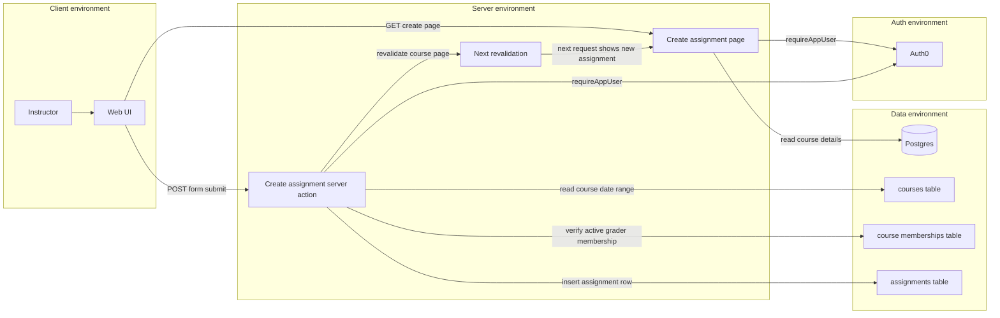
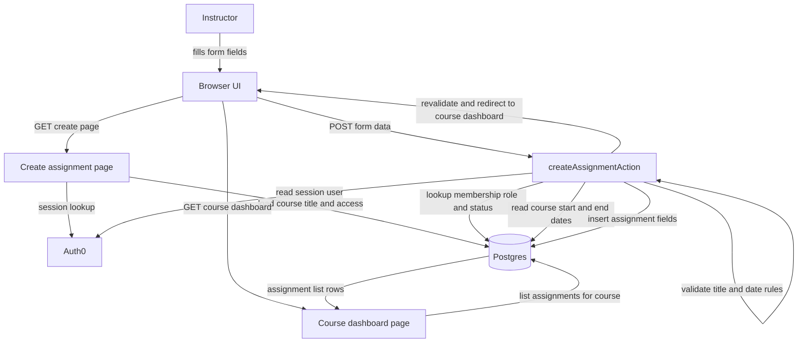
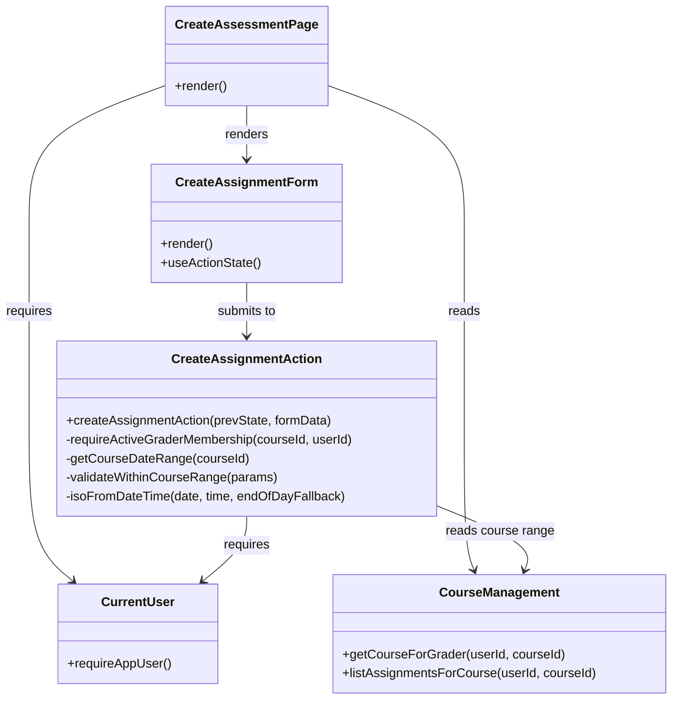

# Development Specification — Create Assignment (Per Course)

## 0) Scope / user story
**User story in scope:** *As an instructor, I want to create a new assignment with all relevant details so that students can clearly understand and submit the assignment for the correct course.*

**Important repo-specific terminology (grounded in current implementation):**
- The system models course roles in `course_memberships.role` with values such as `"student"` and `"grader"`.
- In the UI/data layer, any non-student viewer is labeled `"Instructor"` (see `viewerRole` computed in `lib/course-management.ts`).
- **Assignment creation is enforced server-side by requiring an active `"grader"` membership** for the course (see `requireActiveGraderMembership(...)` in `app/courses/[courseId]/assessments/actions.ts`).

**In-scope behaviors (as implemented in this repo today):**
- Create a new assignment from a course-scoped route (`/courses/[courseId]/assessments/new`).
- Title is required; description is optional.
- Start/end date and time are optional; if omitted the action derives defaults (release defaults to “now”, due defaults to course end-of-day).
- Assignment dates are validated to be within the course date range when explicitly provided.
- The created assignment is linked to a single course via `assignments.course_id`.
- After creation, the course dashboard lists the assignment immediately (via revalidation + redirect).

**Out of scope (not implemented as part of this story’s pipeline):**
- Selecting a course from a dropdown during creation (course is chosen by navigation to the course-scoped create page and sent as a hidden `courseId` input).
- Publishing workflow (created assignments are `is_published = false` by default).
- Rubric authoring (exists elsewhere in repo, but not created in this flow).
- File storage for assignment content (assignment metadata is stored in Postgres; student submission files are handled by the separate submissions feature).

---

## 0.1) Ownership and merge metadata
- **Primary owner (by git authorship of the create-assignment commit):** `vickyc2266`
- **Secondary owner (by git authorship on surrounding course/assessment UX):** `KesterTan`
- **Date merged into `main`:** **2026-03-24**
  - Evidence: commit `ae11a79` — *`Create Assignments per Course with the right field and permission requirements (#6)`*

---

## 1) Architecture diagram (Mermaid, with execution locations)

---

## 2) Information flow diagram (Mermaid, data + direction)

**Primary user/application data moved:**
- User-entered assignment fields (title, description, dates, times, resubmission flags)
- Membership identity and role (used for authorization)
- Course date range (used for validation)
- Inserted assignment row (persisted to DB)

---

## 3) Class diagram (Mermaid, superclass/subclass relationships)
This pipeline is implemented using **React function components** and **server functions**. There are no first-party `class` declarations for assignment creation. The diagram below represents “class-like” modules to keep a consistent inventory that can be checked against Section 4.

---

## 4) “Class” inventory with fields/methods (public first, private second; grouped by concept)

### A) UI entry points
#### `CreateAssessmentPage` (`app/courses/[courseId]/assessments/new/page.tsx`)
**Public fields/methods**
- **Routing contract**
  - `default export async function CreateAssessmentPage({ params })`: server component that renders the “Create assignment” page for a specific `courseId`.
- **Behavior**
  - Reads current user via `requireAppUser()`.
  - Parses `courseId` and loads course via `getCourseForGrader(user.id, courseId)`.
  - If invalid or inaccessible course: renders an in-app error card rather than `notFound()`.
  - Renders `CreateAssignmentForm` with `courseId` when course is available.

**Private fields/methods**
- None (behavior is inline in the server component).

#### `CreateAssignmentForm` (`app/courses/[courseId]/assessments/_components/create-assignment-form.tsx`)
**Public fields/methods**
- **Component API**
  - `CreateAssignmentForm({ courseId })`: client component that renders the form and submits to the server action.
- **Public behaviors (user-visible)**
  - Fields include title, description, start/end date + time, optional late deadline, optional resubmissions.
  - Uses `useActionState(createAssignmentAction, initialState)` to receive `errors` and `values`.
  - Preserves user input on server validation errors via `defaultValue={state.values?.field ?? ""}`.

**Private fields/methods**
- **Local state**
  - `allowResubmissions` checkbox state (controls resubmission input visibility).
  - `enableLateDeadline` checkbox state (controls late deadline input visibility).
- **Derived display**
  - `dateError` memo derived from `state.errors.endDate[0]` for inline rendering.

#### `CourseDashboardPage` (`app/courses/[courseId]/page.tsx`)
**Public fields/methods**
- Displays a “Create assessment” button only when `viewerRole === "Instructor"`.
- Lists assignments for the course by calling `listAssignmentsForCourse(user.id, courseId)`.
- Displays assignment description under the title when present.

**Private fields/methods**
- `formatDate(value: string)` uses `parseISO` to render `startDate` / `endDate` safely for date-only strings.

---

### B) Server-side creation and validation
#### `createAssignmentAction` (`app/courses/[courseId]/assessments/actions.ts`)
**Public fields/methods**
- `export async function createAssignmentAction(prevState, formData) -> AssignmentFormState`
  - Authenticates via `requireAppUser()`.
  - Authorizes via `requireActiveGraderMembership(courseId, user.id)`:
    - requires `course_memberships.role = "grader"` and `status = "active"`.
  - Validates title via Zod (`Assignment title is required`).
  - Validates start/end ordering and same-day time ordering (end time must not be earlier than start time).
  - Validates explicit assignment dates/times are within the course start/end range.
  - Defaults:
    - `releaseAt` defaults to `now` when `startDate` is omitted.
    - `dueAt` defaults to course end-of-day when `endDate` is omitted.
  - Optional late deadline:
    - when enabled, requires `lateUntilDate` and ensures late deadline is after the normal deadline and within the course range.
  - Inserts a new row into `assignments` with:
    - `courseId`, `title`, `description`
    - `releaseAt`, `dueAt`, `lateUntil`
    - `allowResubmissions`, `maxAttemptResubmission`
    - `assignmentType = "written"`, `submissionType = "text"`, `totalPoints = 0`, `isPublished = false`, `createdByUserId = user.id`
  - Calls `revalidatePath("/courses/:courseId")` and redirects back to the course dashboard.

**Private fields/methods**
- `readFormValue(formData, key)`: reads string form values with a safe fallback.
- `assignmentFieldsSchema` / `createAssignmentSchema` (Zod): field parsing and cross-field validation hooks.
- `isoFromDateTime(date, time, endOfDayFallback)`: converts date+time inputs into an ISO string (UTC-based).
- `requireActiveGraderMembership(courseId, userId)`: DB lookup ensuring active grader membership.
- `getCourseDateRange(courseId)`: DB lookup for `courses.startDate` / `courses.endDate`.
- `validateWithinCourseRange(params)`: enforces:
  - start <= end (with special handling to attach same-day ordering errors to the end-time field)
  - explicit start and end within course boundaries

---

### C) Data layer helpers
#### `getCourseForGrader` and `listAssignmentsForCourse` (`lib/course-management.ts`)
**Public fields/methods**
- `getCourseForGrader(userId, courseId)`:
  - Loads course details for any active membership; returns `viewerRole` as Student vs Instructor.
- `listAssignmentsForCourse(userId, courseId)`:
  - Returns assignment summaries (id, title, description, dueAt, submissionCount) for any active membership.
  - This is the source of truth for rendering the course dashboard assignment list.

**Private fields/methods**
- Query aliases and join logic (Drizzle SQL query composition).

---

## 5) External technologies/libraries/APIs (with versions, purpose, rationale, source, author, docs)
This table lists **all** third-party dependencies declared in `package.json` (runtime and dev), plus the core platform technologies they imply.

> “Why chosen” reflects typical engineering tradeoffs; it does not imply the team evaluated every alternative formally.

| Technology | Required version (repo) | Used for | Why chosen over others | Source | Author / org | Docs |
|---|---:|---|---|---|---|---|
| Node.js | (not pinned in repo) | Server runtime for Next.js + route handlers | Standard for Next.js | `https://nodejs.org/` | OpenJS Foundation | `https://nodejs.org/en/docs` |
| TypeScript | `5.7.3` | Static typing | Safer refactors, editor tooling | `https://www.typescriptlang.org/` | Microsoft | `https://www.typescriptlang.org/docs/` |
| Next.js | `16.2.1` | App Router pages + API route handlers | Full-stack React framework with server rendering | `https://github.com/vercel/next.js` | Vercel | `https://nextjs.org/docs` |
| React | `19.2.4` | UI rendering | Ecosystem + Next.js default | `https://github.com/facebook/react` | Meta | `https://react.dev/` |
| React DOM | `19.2.4` | DOM renderer | Required for React web apps | `https://github.com/facebook/react` | Meta | `https://react.dev/reference/react-dom` |
| @auth0/nextjs-auth0 | `^4.15.0` | Auth0 session handling | Turnkey Auth0 integration for Next.js | `https://github.com/auth0/nextjs-auth0` | Auth0 | `https://auth0.com/docs/quickstart/webapp/nextjs` |
| drizzle-orm | `^0.45.1` | Typed SQL/ORM | Type-safe queries, light abstraction | `https://github.com/drizzle-team/drizzle-orm` | Drizzle Team | `https://orm.drizzle.team/docs/overview` |
| pg | `^8.20.0` | Postgres driver | Common Node Postgres client | `https://github.com/brianc/node-postgres` | Brian Carlson | `https://node-postgres.com/` |
| zod | `^3.24.1` | Runtime validation (used elsewhere in repo) | TS-friendly schemas | `https://github.com/colinhacks/zod` | Colin McDonnell | `https://zod.dev/` |
| date-fns | `4.1.0` | Date formatting in UI | Small, functional date utilities | `https://github.com/date-fns/date-fns` | date-fns contributors | `https://date-fns.org/` |
| lucide-react | `^0.564.0` | Icons | Simple icon library | `https://github.com/lucide-icons/lucide` | Lucide | `https://lucide.dev/` |
| @vercel/analytics | `1.6.1` | Analytics (optional) | Vercel integration | `https://github.com/vercel/analytics` | Vercel | `https://vercel.com/docs/analytics` |
| @vercel/functions | `^3.4.3` | Vercel functions helpers | Vercel platform integration | `https://github.com/vercel/vercel` | Vercel | `https://vercel.com/docs/functions` |
| vercel | `^50.35.0` | Vercel CLI | Deploy/preview tooling | `https://github.com/vercel/vercel` | Vercel | `https://vercel.com/docs/cli` |
| dotenv | `^16.4.7` | Env var loading (scripts) | Standard env loader | `https://github.com/motdotla/dotenv` | motdotla | `https://github.com/motdotla/dotenv#readme` |
| tsx | `^4.7.2` | Run TS scripts | Ergonomic TS script runner | `https://github.com/esbuild-kit/tsx` | esbuild-kit | `https://github.com/esbuild-kit/tsx#readme` |
| vitest | `^2.1.9` | Unit tests | Fast Vite-based test runner | `https://github.com/vitest-dev/vitest` | Vitest | `https://vitest.dev/` |
| vite-tsconfig-paths | `^5.1.4` | TS path aliases in tests | Less import boilerplate | `https://github.com/aleclarson/vite-tsconfig-paths` | Alec Larson | `https://github.com/aleclarson/vite-tsconfig-paths#readme` |
| Tailwind CSS | `^4.1.9` | Styling | Utility-first styling | `https://github.com/tailwindlabs/tailwindcss` | Tailwind Labs | `https://tailwindcss.com/docs` |
| postcss | `^8.5` | CSS processing | Tailwind dependency | `https://github.com/postcss/postcss` | PostCSS | `https://postcss.org/` |
| @tailwindcss/postcss | `^4.1.13` | Tailwind PostCSS plugin | Tailwind v4 integration | `https://github.com/tailwindlabs/tailwindcss` | Tailwind Labs | `https://tailwindcss.com/docs/installation` |
| autoprefixer | `^10.4.20` | CSS vendor prefixes | Common PostCSS plugin | `https://github.com/postcss/autoprefixer` | Autoprefixer | `https://github.com/postcss/autoprefixer#readme` |
| clsx | `^2.1.1` | Conditional classnames | Small + common | `https://github.com/lukeed/clsx` | Luke Edwards | `https://github.com/lukeed/clsx#readme` |
| tailwind-merge | `^3.3.1` | Merge Tailwind classes | Avoid conflicting utilities | `https://github.com/dcastil/tailwind-merge` | David Castillo | `https://github.com/dcastil/tailwind-merge#readme` |
| class-variance-authority | `^0.7.1` | Variant-based styling | Patterns for component variants | `https://github.com/joe-bell/cva` | Joe Bell | `https://cva.style/docs` |
| tw-animate-css | `1.3.3` | Animation utilities | Tailwind animation convenience | `https://github.com/jamiebuilds/tw-animate-css` | Jamie Builds | `https://github.com/jamiebuilds/tw-animate-css` |
| next-themes | `^0.4.6` | Theme toggling | Common Next theme solution | `https://github.com/pacocoursey/next-themes` | Paco | `https://github.com/pacocoursey/next-themes#readme` |
| @hookform/resolvers | `^3.9.1` | Form schema resolvers | Common RHF companion | `https://github.com/react-hook-form/resolvers` | React Hook Form | `https://react-hook-form.com/docs/useform/#resolver` |
| react-hook-form | `^7.54.1` | Form handling | Mature form library | `https://github.com/react-hook-form/react-hook-form` | React Hook Form | `https://react-hook-form.com/` |
| sonner | `^1.7.1` | Toast notifications | Simple toast lib | `https://github.com/emilkowalski/sonner` | Emil Kowalski | `https://sonner.emilkowal.ski/` |
| cmdk | `1.1.1` | Command palette UI | Polished command menu | `https://github.com/pacocoursey/cmdk` | Paco | `https://cmdk.paco.me/` |
| vaul | `^1.1.2` | Drawer UI | Mobile-friendly drawers | `https://github.com/emilkowalski/vaul` | Emil Kowalski | `https://vaul.emilkowal.ski/` |
| embla-carousel-react | `8.6.0` | Carousel UI | Lightweight carousel | `https://github.com/davidjerleke/embla-carousel` | David Jerleke | `https://www.embla-carousel.com/` |
| input-otp | `1.4.2` | OTP inputs | Purpose-built OTP UI | `https://github.com/guilhermerodz/input-otp` | Guilherme Rodz | `https://github.com/guilhermerodz/input-otp` |
| react-day-picker | `9.13.2` | Date picker | Popular date picker | `https://github.com/gpbl/react-day-picker` | React Day Picker | `https://react-day-picker.js.org/` |
| react-resizable-panels | `^2.1.7` | Split panes | Resizable layouts | `https://github.com/bvaughn/react-resizable-panels` | Brian Vaughn | `https://github.com/bvaughn/react-resizable-panels#readme` |
| recharts | `2.15.0` | Charts | Popular React charts | `https://github.com/recharts/recharts` | Recharts | `https://recharts.org/en-US/` |
| @aws-sdk/rds-signer | `^3.1013.0` | AWS RDS IAM auth (DB) | Avoid static DB passwords | `https://github.com/aws/aws-sdk-js-v3` | AWS | `https://docs.aws.amazon.com/AWSJavaScriptSDK/v3/latest/` |
| @types/node | `^22` | TS Node types | Dev typing | `https://github.com/DefinitelyTyped/DefinitelyTyped` | DefinitelyTyped | `https://www.typescriptlang.org/docs/handbook/declaration-files/consumption.html` |
| @types/pg | `^8.11.6` | TS typings for `pg` | Dev typing | `https://github.com/DefinitelyTyped/DefinitelyTyped` | DefinitelyTyped | `https://node-postgres.com/features/typescript` |
| @types/react | `19.2.14` | TS typings for React | Dev typing | `https://github.com/DefinitelyTyped/DefinitelyTyped` | DefinitelyTyped | `https://react.dev/learn/typescript` |
| @types/react-dom | `19.2.3` | TS typings for React DOM | Dev typing | `https://github.com/DefinitelyTyped/DefinitelyTyped` | DefinitelyTyped | `https://react.dev/learn/typescript` |
| Radix UI packages | (see `package.json`) | Accessible primitives (dialogs, menus, etc.) | Good accessibility defaults | `https://github.com/radix-ui/primitives` | WorkOS / Radix | `https://www.radix-ui.com/primitives/docs/overview/introduction` |

**Radix UI package list (declared in `package.json`):**
- `@radix-ui/react-accordion@1.2.12`
- `@radix-ui/react-alert-dialog@1.1.15`
- `@radix-ui/react-aspect-ratio@1.1.8`
- `@radix-ui/react-avatar@1.1.11`
- `@radix-ui/react-checkbox@1.3.3`
- `@radix-ui/react-collapsible@1.1.12`
- `@radix-ui/react-context-menu@2.2.16`
- `@radix-ui/react-dialog@1.1.15`
- `@radix-ui/react-dropdown-menu@2.1.16`
- `@radix-ui/react-hover-card@1.1.15`
- `@radix-ui/react-label@2.1.8`
- `@radix-ui/react-menubar@1.1.16`
- `@radix-ui/react-navigation-menu@1.2.14`
- `@radix-ui/react-popover@1.1.15`
- `@radix-ui/react-progress@1.1.8`
- `@radix-ui/react-radio-group@1.3.8`
- `@radix-ui/react-scroll-area@1.2.10`
- `@radix-ui/react-select@2.2.6`
- `@radix-ui/react-separator@1.1.8`
- `@radix-ui/react-slider@1.3.6`
- `@radix-ui/react-slot@1.2.4`
- `@radix-ui/react-switch@1.2.6`
- `@radix-ui/react-tabs@1.1.13`
- `@radix-ui/react-toast@1.2.15`
- `@radix-ui/react-toggle@1.1.10`
- `@radix-ui/react-toggle-group@1.1.11`
- `@radix-ui/react-tooltip@1.2.8`

---

## 6) Long-term storage (database) data types and byte sizing
This story’s durable state is in **Postgres** via the `assignments` table. No files are stored as part of assignment creation.

### 6.1) Database datatypes written by this story

#### `assignments` (`gradience.assignments`) — written by `createAssignmentAction`
Source: `db/schema.ts`.

| Field | Postgres type (logical) | Purpose | Approx bytes (data only) |
|---|---|---|---:|
| `id` | `bigserial` | Primary key | 8 |
| `course_id` | `bigint` | Link to course | 8 |
| `title` | `text` | Assignment title | ~ (4 + N)\* |
| `description` | `text` nullable | Assignment instructions | ~ (4 + N)\* or 0 (null) |
| `release_at` | `timestamptz` | Start/release timestamp | 8 |
| `due_at` | `timestamptz` | Due timestamp | 8 |
| `late_until` | `timestamptz` nullable | Late window end | 8 (if present) |
| `allow_resubmissions` | `bool` | Resubmission toggle | 1 |
| `max_attempt_resubmission` | `int` | Max submissions allowed | 4 |
| `assignment_type` | `text` | Set to `"written"` | ~ (4 + N)\* |
| `submission_type` | `text` | Set to `"text"` | ~ (4 + N)\* |
| `total_points` | `int` | Points possible (defaulted to 0 here) | 4 |
| `is_published` | `bool` | Publish toggle | 1 |
| `created_by_user_id` | `bigint` | Creator user id | 8 |
| `created_at` | `timestamptz` | Row creation time | 8 |
| `updated_at` | `timestamptz` | Row update time | 8 |

\* For Postgres `text`, a useful approximation is \(4 + N\) bytes for short values (not counting tuple/page overhead).

### 6.2) Database datatypes read for validation/authorization
- `courses.start_date` and `courses.end_date`: used to enforce assignment range.
- `course_memberships.role` and `course_memberships.status`: used to enforce “instructor only” creation.
- `users.*`: accessed indirectly through `requireAppUser()` (ensures a user row exists).

---

## 7) Failure-mode effects (frontend perspective)

| Failure condition (required list) | User-visible effect | Internally-visible effect |
|---|---|---|
| Frontend crashed its process | User loses unsaved form input | No server write unless request already submitted |
| Frontend lost all runtime state | Form resets; errors cleared | Server unaffected |
| Frontend erased all stored data | No local caches/drafts | DB unchanged |
| Frontend noticed DB corrupt | Dashboard may show missing assignments or wrong dates | Queries may fail or return inconsistent data |
| Remote procedure call failed | User sees generic error; assignment not created | No assignment row inserted if action did not complete |
| Client overloaded | Slow typing and submit latency | Increased timeouts / retries |
| Client out of RAM | Browser tab may crash; submit likely aborted | Server sees dropped request |
| Database out of space | Submit fails; user sees error | Assignment insert fails |
| Lost network connectivity | Submit fails; user can retry later | No server state change during outage |
| Lost access to its database | Create action fails | No assignment row inserted |
| Bot signs up and spams users | Bot could create many assignments if granted grader membership | No built-in rate limiting; mitigations needed at auth/edge |

---

## 8) PII in long-term storage
This story does not add new categories of PII beyond existing user and membership data, but it interacts with PII because instructor identity is stored and used for access control.

### 8.1) PII stored in Postgres
| PII item | Why needed | Where stored | How it enters | How it flows into storage | How it flows out |
|---|---|---|---|---|---|
| User email | Account identity and display | `users.email` | Auth0 session | `requireAppUser()` → `ensureUserRecord()` → `db.insert(users)` | Displayed in UI headers and instructor/student lists |
| User first/last name | Display name | `users.first_name`, `users.last_name` | Auth0 session or derived | `splitName()` → `ensureUserRecord()` → insert/update | Displayed on dashboards |
| Auth provider id | Account linking | `users.auth_provider_id` | Auth0 session | `requireAppUser()` → insert/update | Used internally for future logins |

### 8.2) Potential PII in assignment content
- `assignments.description` may contain student names or other sensitive details if instructors include them. It is stored as free-form text in Postgres.

### 8.3) Storage security ownership and auditing
The repo does not define an ownership matrix or audit policy. Any owner/audit section must be set by the team’s process, not inferred from code.

### 8.4) Minors (<18) PII
The system does not solicit age, but course participants could be minors. No guardian consent flow exists in code.

---

## 9) Acceptance criteria mapping (implementation vs story)

### Machine Acceptance Criteria
- **Create assignment with required fields** ✅/⚠️
  - Title/description/start/end fields exist in the form.
  - **Title is required**; description and dates are optional (repo behavior differs from “start/end required” phrasing).
  - Time fields and additional settings exist (late deadline, resubmissions).
- **Enforce required title field** ✅
  - Zod validation in `createAssignmentSchema` returns `Assignment title is required`.
  - Form displays error and preserves entered values.
- **Restrict assignment creation to instructors only** ✅
  - UI: “Create assessment” button renders only for `viewerRole === "Instructor"`.
  - Server: `requireActiveGraderMembership` enforces `role = "grader"` and `status = "active"`.
  - Note: students can manually navigate to the create URL, but server action rejects creation.
- **Associate assignment with a course** ✅
  - `courseId` is a hidden field, and insert sets `assignments.course_id`.
- **Display assignment in correct course** ✅
  - After insert, `revalidatePath("/courses/:courseId")` + redirect back to the course dashboard.
  - Course dashboard queries assignments by `assignments.course_id`.

### Human Acceptance Criteria
- **Form is intuitive and labeled** ✅
  - Fields are clearly labeled; conditional sections (late deadline, resubmissions) appear only when enabled.
- **Errors are clear** ✅
  - Inline field-level errors for title/dates/times and form-level permission errors.
- **Only instructors see create option** ✅
  - Create button is gated in course dashboard by viewer role.
- **Assignment appears immediately** ✅
  - Revalidation + redirect ensures the next render includes the new assignment.

---

## 10) Known gaps / follow-ups
1) If product requirements truly require start/end dates, update the schema validation to require them (currently optional).
2) Consider adding page-level guarding for students who manually visit the create route (currently the server action blocks creation, but the page still renders).
3) Consider adding rate limiting or quotas for assignment creation if abuse becomes a concern.

