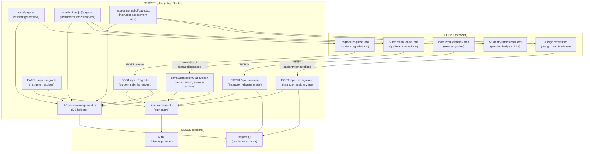
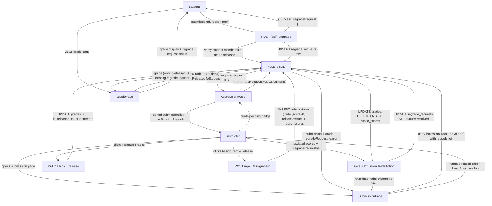

# Development Specification — PR #61

## 0) Scope / PR Summaries
- **Tracking issue (created before dev spec):** https://github.com/KesterTan/GradienceV2/issues/68

### PR #61
- **Title:** Add regrade requests with LLM automation evidence
- **Author:** orangebelly (Scarlett Huang)
- **URL:** https://github.com/KesterTan/GradienceV2/pull/61
- **Merged at:** 2026-04-21T04:28:36Z
- **Reviewers:** Nita242004 (approved), coderabbitai (automated review)
- **Linked issues:** https://github.com/GradientV1/Toothless/issues/67

**Summary:**
Adds a structured student-to-instructor regrade dispute workflow. Students can request a regrade on a released submission by providing a reason. Instructors see pending requests pinned at the top of the assessment view with an amber badge, can open the submission page to read the reason, edit rubric scores, and click "Save & resolve" to close the request. Separately adds an instructor "Release grades" action (sets `isReleasedToStudent=true`) and an "Assign zero & release" action for students who never submitted. All changes are gated by role-based authorization enforced in API routes and server actions.

---

## 1) Ownership

| Role | Person |
|------|--------|
| Primary owner — PR #61 (author) | orangebelly (Scarlett Huang) |
| Secondary owner — PR #61 (human reviewer) | Nita242004 |
| Automated reviewer | coderabbitai |

---

## 2) Merge Date

- **PR #61 merged at:** 2026-04-21T04:28:36Z

---

## 3) Architecture Diagram

---

## 4) Information Flow Diagram

---

## 5) Class Diagram

```mermaid
classDiagram
    class RegradeRequest {
        +number id
        +number submissionId
        +number studentMembershipId
        +string reason
        +string status
        +string createdAt
    }

    class RegradeRequestSummary {
        +number id
        +number submissionId
        +number studentMembershipId
        +string reason
        +string status
        +string createdAt
        +string studentName
        +string studentEmail
    }

    class SubmissionGrade {
        +number id
        +number totalScore
        +string|null overallFeedback
        +string gradedAt
        +boolean isReleasedToStudent
        +Array rubricScores
    }

    class SubmissionGradeDetail {
        +number id
        +number attemptNumber
        +string status
        +string submittedAt
        +string|null textContent
        +string|null fileUrl
        +string studentName
        +string studentEmail
        +number assignmentId
        +string assignmentTitle
        +number totalPoints
        +number courseId
        +string courseTitle
        +Array rubricQuestions
        +SubmissionGrade|null grade
        +RegradeRequest|null regradeRequest
    }

    class SubmissionGradeQuestion {
        +string questionId
        +string questionName
        +number maxScore
        +Array rubricItems
    }

    class RegradeRequestCard {
        +number courseId
        +number assignmentId
        +number submissionId
        -string reason
        -boolean submitting
        -string|null error
        -RegradeRequest|null existingRequest
        +handleSubmit()
    }

    class InstructorReleaseButton {
        +number courseId
        +number assignmentId
        +number submissionId
        +boolean isReleased
        -boolean releasing
        -boolean released
        -string|null error
        +handleRelease()
    }

    class AssignZeroButton {
        +number courseId
        +number assignmentId
        +number studentMembershipId
        -boolean loading
        -string|null error
        +handleAssignZero()
    }

    class StudentSubmissionsCard {
        +number courseId
        +number assignmentId
        +SubmissionSummary[] versions
        +boolean|undefined hasPendingRegrade
        -boolean historyOpen
    }

    class SubmissionGradeForm {
        +number courseId
        +number assignmentId
        +number submissionId
        +number totalPoints
        +SubmissionGradeQuestion[] rubricQuestions
        +SubmissionGrade|null initialGrade
        +number|undefined regradeRequestId
        -Record scores
        -Record itemComments
        -string overallFeedback
    }

    SubmissionGradeDetail --> SubmissionGrade
    SubmissionGradeDetail --> RegradeRequest
    SubmissionGradeDetail --> SubmissionGradeQuestion
    RegradeRequestSummary --|> RegradeRequest
    SubmissionGradeForm --> SubmissionGrade
    SubmissionGradeForm --> SubmissionGradeQuestion
```

---

## 6) Class Reference

### `RegradeRequest` (`lib/course-management.ts`)
**Public fields:**
- `id` — database primary key of the regrade request
- `submissionId` — FK to the submission this request is for
- `studentMembershipId` — FK to the course_memberships row for the requesting student
- `reason` — free-text reason the student provided
- `status` — `"pending"` or `"resolved"`
- `createdAt` — ISO timestamp of request creation

### `RegradeRequestSummary` (`lib/course-management.ts`)
Extends `RegradeRequest` with denormalized display fields:
- `studentName` — full name (trimmed first + last from users table)
- `studentEmail` — email from users table

### `SubmissionGrade` (`lib/course-management.ts`)
**Public fields:**
- `id` — grade row primary key
- `totalScore` — sum of all rubric item scores
- `overallFeedback` — optional instructor written feedback
- `gradedAt` — ISO timestamp of last grading action
- `isReleasedToStudent` — whether the student can see this grade
- `rubricScores` — array of `{ displayOrder, pointsAwarded, comment }` per rubric item

### `SubmissionGradeDetail` (`lib/course-management.ts`)
Full return type of `getSubmissionGradeForGrader` and `getSubmissionGradeForStudent`. Contains all submission metadata, nested `grade` (null if ungraded or unreleased for students), nested `regradeRequest` (null if none exists), and `rubricQuestions` for rendering the grade form.

### `RegradeRequestCard` (`grade/_components/regrade-request-card.tsx`)
**Public props:** `courseId`, `assignmentId`, `submissionId`
**Private state:**
- `reason` — controlled textarea value
- `submitting` — loading state during POST
- `error` — server error message
- `existingRequest` — fetched on mount; when present, shows read-only status instead of form
**Methods:**
- `handleSubmit()` — POSTs `{ reason }` to `/api/.../regrade`; on success disables form and shows status

### `InstructorReleaseButton` (`components/instructor-release-button.tsx`)
**Public props:** `courseId`, `assignmentId`, `submissionId`, `isReleased`
**Private state:** `releasing`, `released`, `error`
**Methods:**
- `handleRelease()` — PATCHes `.../release`; on success sets `released=true` and calls `router.refresh()`
- When `released` is true renders a green "Grades released" badge instead of a button

### `AssignZeroButton` (`components/assign-zero-button.tsx`)
**Public props:** `courseId`, `assignmentId`, `studentMembershipId`
**Private state:** `loading`, `error`
**Methods:**
- `handleAssignZero()` — POSTs `{ studentMembershipId }` to `.../assign-zero`; on success calls `router.refresh()`

### `StudentSubmissionsCard` (`components/student-submissions-card.tsx`)
**Public props:** `courseId`, `assignmentId`, `versions` (array of `SubmissionSummary`), `hasPendingRegrade`
**Private state:** `historyOpen` — toggles display of older attempt history
Renders amber "Regrade requested" badge and "Review regrade" link button when `hasPendingRegrade` is true, pointing to the submission page.

### `SubmissionGradeForm` (`submissions/[id]/_components/submission-grade-form.tsx`)
**Public props:** `courseId`, `assignmentId`, `submissionId`, `totalPoints`, `rubricQuestions`, `initialGrade`, `regradeRequestId` (optional)
**Private state:** `scores` (per-item score map), `itemComments` (per-item comment map), `overallFeedback`
When `regradeRequestId` is provided: injects hidden `regradeRequestId` input into the form so `saveSubmissionGradeAction` can resolve the regrade; changes manual submit button label to "Save & resolve".

---

## 7) Technologies, Libraries, and APIs

| Technology | Version | Used for | Why chosen over alternatives | Source / Docs |
|------------|---------|----------|------------------------------|---------------|
| TypeScript | 5.x | Primary language for all source files | Type safety across DB schema, API routes, and UI | https://www.typescriptlang.org |
| Next.js | 15.x | App Router, server components, API routes, server actions | Full-stack React framework — already in use across the project | https://nextjs.org |
| React | 19.x | Client component state (`useState`, `useActionState`) | Paired with Next.js; already in use | https://react.dev |
| Drizzle ORM | 0.x | Type-safe PostgreSQL queries in route handlers and course-management helpers | Already in use; avoids raw SQL while keeping query visibility | https://orm.drizzle.team |
| PostgreSQL | 16 | Persistent storage for regrade_requests, grades, rubric_scores | Already in use as primary DB; schema under `gradience` schema | https://www.postgresql.org |
| Auth0 | — | Authentication; `requireAppUser()` validates session and returns user row | Already integrated; SSO handled without custom auth code | https://auth0.com |
| Tailwind CSS | 3.x | Styling for all new UI components (amber badges, cards) | Already in use across the project | https://tailwindcss.com |
| shadcn/ui | — | `Button`, `Card`, `Badge`, `Textarea`, `Input`, `Label` components | Consistent design system; already in use | https://ui.shadcn.com |
| Lucide React | — | `CheckCircle` icon in `InstructorReleaseButton` | Lightweight icon set already used in project | https://lucide.dev |
| date-fns | 3.x | `format()` for regrade request timestamp display | Already in use across date formatting in the app | https://date-fns.org |
| Vitest | 2.x | Unit/integration tests for regrade API routes | Already in use; runs with a real Postgres instance in CI | https://vitest.dev |
| Jest | 29.x | Unit tests for course-management helpers and components | Already in use for pure unit tests without a DB | https://jestjs.io |
| GitHub Actions | — | CI: runs Vitest + Jest on every push/PR | Already configured in `.github/workflows/test.yml` | https://docs.github.com/en/actions |

---

## 8) Data Stored in Long-Term Storage

### Table: `gradience.regrade_requests` (new in this PR)

| Field | Purpose | Estimated bytes/record |
|-------|---------|------------------------|
| `id` (bigserial) | Primary key | 8 |
| `submission_id` (bigint) | FK to submissions — identifies which submission is being disputed | 8 |
| `student_membership_id` (bigint) | FK to course_memberships — identifies requesting student | 8 |
| `reason` (text) | Student's free-text explanation for the regrade request | ~200 (typical) |
| `status` (text) | `"pending"` or `"resolved"` | ~10 |
| `resolved_by_membership_id` (bigint, nullable) | FK to course_memberships — records which instructor resolved it | 8 |
| `resolved_at` (timestamptz, nullable) | When the request was resolved | 8 |
| `created_at` (timestamptz) | When the student submitted the request | 8 |
| `updated_at` (timestamptz) | Last row modification time | 8 |

**Estimated total per record: ~270 bytes**

### Modified fields on existing table: `gradience.grades`

| Field | Purpose | Estimated bytes |
|-------|---------|-----------------|
| `is_released_to_student` (boolean) | Controls student visibility of grade; set to `true` by Release or Assign Zero actions | 1 |
| `released_at` (timestamptz, nullable) | Timestamp of when grade was released | 8 |

These fields existed in the schema prior to this PR but were previously unused. This PR wires them up.

---

## 9) Failure Modes

| Failure scenario | User-visible effect | Internally-visible effect |
|------------------|--------------------|-----------------------------|
| Process crash (Next.js server restart) | Student sees 500 or connection error mid-request; no partial state since DB writes are atomic. Instructor loses unsaved score edits in the form. | Server logs crash; next request starts fresh. In-flight DB transactions are rolled back by Postgres. |
| Lost all runtime state | No visible effect beyond a brief outage — all state is in Postgres, not in-memory | Server restarts cleanly; no warm cache needed |
| Erased all stored data | Students and instructors see empty course/submission lists; no grades, no regrade requests visible | All `gradience.*` tables return zero rows; application pages render "no data" states |
| Corrupt data in database | Regrade request with a non-`"pending"`/`"resolved"` status would silently fall through status checks; a null `reason` would break display | DB constraint violation logged; API returns 500 |
| RPC failure (Auth0 unreachable) | All authenticated routes return 401 or timeout; student/instructor cannot log in or make any request | `requireAppUser()` throws; logged as server error |
| Client overloaded (slow browser) | Regrade form may respond slowly; button states may lag | No server-side effect |
| Client out of RAM | Browser tab crashes; in-flight form state lost | No server-side effect; student must re-open the page |
| Database out of space | INSERT for new regrade request or grade fails with a 500 response | Drizzle throws a DB error; logged; `regrade_requests` insert rolls back |
| Lost network connectivity | Student sees network error on form submit; instructor's "Release" or "Assign zero" button shows no response | Requests never reach server; no partial writes |
| Lost access to database | All page loads and API calls fail with 500 | Drizzle pool exhausted or throws; all routes log DB connection errors |
| Bot signs up and spams users | Bot could submit many regrade requests on the same submission — blocked after first pending request (409 conflict check). Could attempt to flood new accounts submitting reasons. | One pending regrade per submission is enforced at application layer; no DB-level unique constraint currently exists |

---

## 10) Personally Identifying Information (PII)

### 10a) PII in Long-Term Storage

#### Student name and email (in `gradience.users`)
- **Justification:** Required to identify who submitted a regrade request; instructors need to see the student's name when reviewing the queue.
- **How stored:** Plaintext in `first_name`, `last_name`, `email` columns. Database is encrypted at rest via hosting provider (AWS RDS or equivalent). No field-level encryption.
- **How it entered the system:** Auth0 SSO callback → `requireAppUser()` → upsert into `gradience.users` on first login.
- **Data lineage (before storage):** Auth0 JWT → `lib/current-user.ts:requireAppUser()` → `gradience.users`
- **Data lineage (after storage):** `lib/course-management.ts:getSubmissionGradeForGrader()` selects `studentUser.firstName`, `studentUser.lastName`, `studentUser.email` via a JOIN → returned in `SubmissionGradeDetail.studentName` / `studentEmail` → rendered in `submissions/[id]/page.tsx` and `StudentSubmissionsCard`
- **Responsible team member:** Primary owner (orangebelly / Scarlett Huang) for this feature; overall data controller responsibility lies with the team's designated data owner.
- **Audit procedures:** DB access is gated by IAM roles on the hosting platform. Application-level access requires an active `grader` or `student` course membership. No routine audit log currently exists; follow-up story should add access logging.

#### Regrade reason text (in `gradience.regrade_requests.reason`)
- **Justification:** The reason is the core of the dispute workflow — it must be persisted so instructors can read it at any time before resolving.
- **How stored:** Plaintext `text` column. Inherits DB-at-rest encryption from hosting provider.
- **How it entered the system:** Student types reason in `RegradeRequestCard` → POST `/api/.../regrade` → `createRegradeRequest()` → `INSERT` into `regrade_requests`.
- **Data lineage (before storage):** Browser input → `RegradeRequestCard.handleSubmit()` → `POST /api/.../regrade` → `lib/course-management.ts:createRegradeRequest()`
- **Data lineage (after storage):** `getSubmissionGradeForGrader()` / `getSubmissionGradeForStudent()` → `SubmissionGradeDetail.regradeRequest.reason` → rendered in `submissions/[id]/page.tsx` (instructor) and `grade/page.tsx` (student)
- **Responsible team member:** Same as above.
- **Audit procedures:** Readable only to authenticated graders and the submitting student via role-checked API/page queries. No additional audit log currently.

### 10b) Minors' PII
- **Is PII of minors solicited or stored?** Potentially yes — GradienceV2 is a university grading platform. Enrolled students may include students under 18 in dual-enrollment or accelerated programs.
- **Why:** Course enrollment requires a name and email via Auth0 SSO; this cannot be avoided for the platform to function.
- **Is guardian permission solicited?** No — the platform relies on institutional enrollment consent processes at the university level, not direct guardian consent.
- **Policy for preventing access by those convicted or suspected of child abuse:** No explicit platform-level policy is currently defined. This is delegated to the institution's HR and access-control policies. The team should formally document this policy before production deployment to any institution serving minors.

---

## 11) Diff Summary

Key files changed in PR #61:

| File | Change |
|------|--------|
| `db/schema.ts` | Added `regradeRequests` table definition |
| `db/schema.sql` | Added `CREATE TABLE gradience.regrade_requests` |
| `lib/course-management.ts` | Added `createRegradeRequest`, `getExistingRegradeRequest`, `listRegradeRequestsForAssignment`, `resolveRegradeRequest`; extended `getSubmissionGradeForGrader` and `getSubmissionGradeForStudent` to join regrade requests; added `isReleasedToStudent` gate on student grade view |
| `app/api/.../regrade/route.ts` | New POST (student submits) and PATCH (instructor resolves) handlers |
| `app/api/.../release/route.ts` | New PATCH handler — sets `is_released_to_student=true` |
| `app/api/.../assign-zero/route.ts` | New POST handler — creates submission + zero grade + rubric scores, released immediately |
| `app/courses/.../page.tsx` (assessment) | Fetches pending regrade requests, sorts students with pending requests to top, passes `hasPendingRegrade` to `StudentSubmissionsCard`, adds `AssignZeroButton` for non-submitters |
| `app/courses/.../submissions/[id]/page.tsx` | Shows regrade reason card when pending; passes `regradeRequestId` to `SubmissionGradeForm`; shows `InstructorReleaseButton` |
| `app/courses/.../grade/page.tsx` | Added `RegradeRequestCard` for students when grade is released |
| `components/instructor-release-button.tsx` | New component |
| `components/assign-zero-button.tsx` | New component |
| `components/student-submissions-card.tsx` | Added `hasPendingRegrade` prop, amber badge, "Review regrade" link |
| `submission-grade-form.tsx` | Added `regradeRequestId` prop; "Save & resolve" label; hidden input |
| `actions.ts` | After grade save: reads `regradeRequestId` from formData and marks request resolved |
| `tests/assessments/regrade-route.test.ts` | 10 Vitest tests covering POST/PATCH success, duplicate requests, grade-not-released gate, unauthorized access |

---

## 12) Risks / Assumptions

- **No DB-level uniqueness constraint on pending requests.** Application code enforces one pending request per submission (409 check), but there is no partial unique index on `(submission_id, student_membership_id) WHERE status = 'pending'`. A race condition or direct DB access could create duplicates. Mitigation: add the index in a follow-up migration.
- **`regradeRequestId` is not bound to the submission inside `saveSubmissionGradeAction`.** The action reads the ID from form data and updates any matching regrade request row. The ID is not validated against the current `submissionId` inside the transaction. A crafted form could theoretically resolve a request on a different submission. Mitigation (noted by CodeRabbit): add `eq(regradeRequests.submissionId, submissionId)` to the WHERE clause inside the transaction.
- **`getSubmissionGradeForGrader` returns an arbitrary regrade request when multiple exist** (e.g. after a resolved request and a new pending one). The `leftJoin` has no `ORDER BY` or status filter on the regrade join, so results are non-deterministic. Mitigation: add a filter for `status = "pending"` and order by `createdAt DESC` on the join.
- **Assign-zero does not verify the assignment belongs to the course.** The route validates grader and student membership but does not check that `parsedAssignmentId` references `parsedCourseId`. A grader could submit a zero for an assignment in a different course. Mitigation (noted by CodeRabbit): add an assignment-course membership check before insert.
- **AI grade + save also resolves a regrade**, but the "AI grade & save" button label does not reflect this. Students/instructors may not realize a regrade is being resolved by an AI grading run. Mitigation: change the AI button label to "AI grade, save & resolve" when `regradeRequestId` is present.
- **Regrade reason is stored in plaintext** with no content moderation or length cap beyond "non-empty". A student could submit an extremely long reason. Mitigation: add a `maxLength` constraint at the UI layer and a server-side character limit.
- **`InstructorReleaseButton` renders even when no grade exists.** The button defaults to `isReleased=false` when `submission.grade` is null, allowing an instructor to click "Release grades" on an ungraded submission, which will 404 server-side. Mitigation (noted by CodeRabbit): gate the button render on `submission.grade` presence.

---

## 13) Validation / Acceptance Criteria

- [ ] Log in as a student. Open a released submission. The "Request Regrade" form is visible below the instructor feedback. Enter a reason and submit. Confirm a success message appears and the form collapses to a read-only status.
- [ ] Attempt to submit a second regrade request on the same submission. Confirm the form is disabled and shows "A regrade request is already pending."
- [ ] Attempt to request a regrade on a submission where grades have NOT been released. Confirm the regrade form is not shown.
- [ ] Log in as an instructor. Navigate to the assessment page. Confirm any student with a pending regrade request appears at the top of the list with an amber "Regrade requested" badge.
- [ ] Click "Review regrade" (amber button). Confirm it opens the submission page (not a separate `/regrade` URL).
- [ ] On the submission page, confirm the "Student's regrade request" card is visible with the student's reason and submission timestamp.
- [ ] Confirm the manual save button reads "Save & resolve" (not "Save grades" or "Update grades").
- [ ] Edit rubric scores and click "Save & resolve". Confirm the grade is updated, the regrade badge disappears from the assessment page, and the student's grade page reflects the new score.
- [ ] Log in as the student after resolution. Confirm the grade page shows the updated score and the regrade request card shows a resolved status.
- [ ] Log in as an instructor. On the assessment page, find a student with no submission. Confirm "Assign zero & release" button is present. Click it. Confirm the student disappears from the non-submitters list.
- [ ] Log in as that student. Confirm they can navigate to their grade page and see a score of 0.
- [ ] Log in as an instructor. Open a graded submission. Confirm "Release grades" button is present when the grade has not been released. Click it. Confirm the button changes to "Grades released" (green badge).
- [ ] As a student, attempt to access another student's grade page. Confirm 404 is returned.
- [ ] Run `npm test` — confirm all 10 tests in `tests/assessments/regrade-route.test.ts` pass.
- [ ] Run `npm run test:jest` — confirm all tests pass with no regressions.
