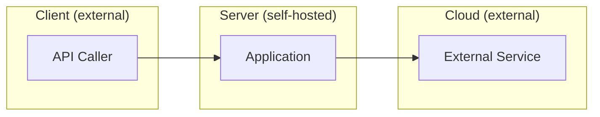
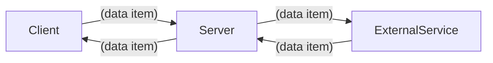
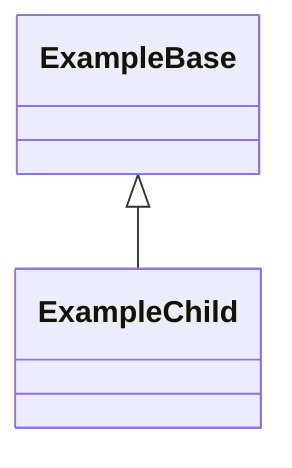

# Development Specification — PR #61

## 0) Scope / PR Summaries
- **Tracking issue (created before dev spec):** https://github.com/KesterTan/GradienceV2/issues/68

### PR #61
- **Title:** Add regrade requests with LLM automation evidence
- **Author:** orangebelly
- **URL:** https://github.com/KesterTan/GradienceV2/pull/61
- **Merged at:** 2026-04-21T04:28:36Z
- **Reviewers:** Nita242004, coderabbitai
- **Linked issues:** #67

**Summary:**
## Linked User Story
- Closes: https://github.com/GradientV1/Toothless/issues/67
- Story label: `story:3`

## Why this is the next increment
Adds a structured student-to-instructor regrade workflow so grading disputes are handled in-product with traceable status, replacing ad-hoc messaging.

## Change Summary
### Backend
- Added/updated regrade request data model and route handling for submit + resolve.
- Enforced role-based authorization and released-grade constraints.
- Integrated resolution path with grade/rubric update flow.

### Frontend
- Added student regrade request UI/state handling.
- Surfaced pending regrade requests in instructor assessment view.
- Added/updated regrade resolution UX in grading flow.

### Tests
- Added/updated `tests/assessments/regrade-route.test.ts` coverage for success/failure/authorization cases.
- CI runs via `.github/workflows/test.yml` on `pull_request` and `push`.

## Automated Code Generation (Requirement 3)
- Repeatable workflow used:
  - `npm run llm:story:implementation`
  - Prompt source: `prompts/regrade-implementation.prompt.md`
  - Story prompt builder: `scripts/llm/build-story-prompt.mjs`
  - Process doc: `docs/regrade-story-automation.md`
- Human responsibilities:
  - Verified correctness, fixed conflicts, and made final product/security decisions.
  - Human review/approval required before merge.

## Automated Testing in CI (Requirement 4)
- LLM-assisted testing workflow used:
  - `npm run llm:story:tests`
  - Prompt source: `prompts/regrade-tests.prompt.md`
  - Test workflow helper: `automation/scripts/start_test_workflow.sh`
- CI workflow: `.github/workflows/test.yml`
- Tracking issue for test work (linked): #<test-issue-number>
- Commit(s) referencing test issue: <commit-sha or “included in this PR”>

## Automated Code Review (Requirement 5)
- Automation: `.github/workflows/llm-pr-review.yml`
- Expected output location: PR comment titled `Automated LLM Review`.
- Human judgment:
  - Human reviewers determine merge readiness.
  - LLM output used as advisory input only.
- After workflow runs, add link to bot comment:
  - <PR comment URL>

## Automated Development Specification (Requirement 6)
- Trigger on approval: `.github/workflows/dev-spec-on-approval.yml`
- Story mapping: `.github/dev-spec-mapping.json` (`story:3` -> `DEV_SPEC_REGRADE_REQUESTS.md`)
- Prompts:
  - Create: `prompts/dev-spec-create.prompt.md`
  - Update: `prompts/dev-spec-update.prompt.md`
- Expected outputs after approval:
  - Auto-created dev spec tracking issue: <issue URL>
  - Auto-created docs PR with spec update: <PR URL>

## Human Review Checklist
- [ ] I validated LLM-generated suggestions before accepting them.
- [ ] Security-sensitive config/secrets were handled by humans.
- [ ] Merge decision remains human-owned.

## Evidence Links (fill after workflows run)
- Story issue: <issue URL>
- This feature PR: <PR URL>
- LLM review comment/log: <URL>
- Successful CI run: <URL>
- Dev spec tracking issue: <URL>
- Dev spec PR: <URL>
- Chat/shareable logs for this story: <URL(s)>

<!-- This is an auto-generated comment: release notes by coderabbit.ai -->
## Summary by CodeRabbit

* **New Features**
  * Student regrade requests (submit reason) and instructor resolution flow
  * Instructor “Release grades” and “Assign zero” actions; UI badges/links for pending regrades
  * Automated LLM PR review and dev-spec generation workflows; auto-created docs PRs and tracking issues
  * New regrade_requests persistence table and related data surfaced in grade views

* **Documentation**
  * Dev-specs, automation guides, evidence templates, and LLM prompt templates added

* **Tests**
  * End-to-end and route tests for regrade routes and behaviors

* **Chores**
  * New CLI/script helpers and npm scripts; dependency updates
<!-- end of auto-generated comment: release notes by coderabbit.ai -->

---
## 1) Ownership

| Role | Person |
|------|--------|
| Primary owner — PR #61 (author) | orangebelly |
| Secondary owner(s) — PR #61 (reviewers) | Nita242004, coderabbitai |

---
## 2) Merge Date

- **PR #61 merged at:** 2026-04-21T04:28:36Z

---
## 3) Architecture Diagram

> Show all architectural components and **where they execute** (client / server / cloud / edge / device).
> Use Mermaid. Label each node with its execution context.



---
## 4) Information Flow Diagram

> Show which **user information and application data** moves between architectural components and the direction of flow.
> Use Mermaid. Label each edge with the data item and its direction.



---
## 5) Class Diagram

> Show **all** classes relevant to this user story's implementation in superclass/subclass relationships.
> Include every class and interface. This diagram will be verified for completeness.



---
## 6) Class Reference

> For every class listed in section 5, provide all **public** fields and methods (grouped by concept),
> then all **private** fields and methods (grouped by concept). Explain the purpose of each.

(TODO: fill in complete class reference)

---
## 7) Technologies, Libraries, and APIs

> List every technology, library, and API used that you are **not** writing yourself.
> Include language, common libraries, and required tools. Do not omit anything.

| Technology | Version | Used for | Why chosen over alternatives | Source / Author / Docs |
|------------|---------|----------|------------------------------|------------------------|
| (TODO) | | | | |

---
## 8) Data Stored in Long-Term Storage

> For each data type stored in a database, explain the purpose of each field.
> Estimate storage size in bytes per record.

(TODO: list each database table/collection, field purposes, and per-record storage estimates)

---
## 9) Failure Modes

> For each scenario below, describe the **user-visible** and **internally-visible** effects.

| Failure scenario | User-visible effect | Internally-visible effect |
|------------------|--------------------|-----------------------------|
| Process crash | | |
| Lost all runtime state | | |
| Erased all stored data | | |
| Corrupt data detected in database | | |
| Remote procedure call (RPC) failed | | |
| Client overloaded | | |
| Client out of RAM | | |
| Database out of space | | |
| Lost network connectivity | | |
| Lost access to database | | |
| Bot signs up and spams users | | |

---
## 10) Personally Identifying Information (PII)

> List all PII stored in long-term storage. For each item:
> - Justify why it must be kept
> - How it is stored (encrypted at rest? field-level? hashed?)
> - How it entered the system
> - Which modules/components/classes/methods/fields it passed through before storage
> - Which modules/components/classes/methods/fields it passes through after leaving storage
> - Who on the team is responsible for securing each storage unit
> - Audit procedures for routine and non-routine access

### 10a) PII in Long-Term Storage

(TODO: list each PII field, justification, storage mechanism, and data lineage)

### 10b) Minors' PII

- Is PII of minors (under 18) solicited or stored? (TODO: yes / no / explain)
- Why? (TODO)
- Is guardian permission solicited? (TODO: yes / no / explain)
- Policy for ensuring minors' PII is inaccessible to anyone convicted or suspected of child abuse: (TODO)

---
## 11) Diff Summary

```diff


# Diff for PR 61

diff --git a/.github/PULL_REQUEST_TEMPLATE.md b/.github/PULL_REQUEST_TEMPLATE.md
new file mode 100644
index 0000000..2640a7b
--- /dev/null
+++ b/.github/PULL_REQUEST_TEMPLATE.md
@@ -0,0 +1,23 @@
+## Linked User Story
+- Closes #
+- Story label on this PR: `story:<id>` (required for spec automation)
+
+## Change Summary
+- Backend:
+- Frontend:
+- Tests:
+
+## Automated LLM Review Evidence
+- [ ] I confirmed `LLM PR Review` workflow ran on this PR
+- [ ] I reviewed the bot comment and captured any follow-up changes
+- [ ] I documented where the review output appears (PR comment/check logs)
+
+## Human Judgment and Approval
+- [ ] Human reviewer validated correctness beyond LLM feedback
+- [ ] Human reviewer approved merge decision
+- Notes on how LLM output informed review:
+
+## Development Specification Automation
+- [ ] On approval, `Dev Spec Automation On Approval` should run
+- [ ] Result should appear as an auto-generated docs PR and linked tracking issue
+- [ ] I verified the generated spec for accuracy before merge
diff --git a/.github/dev-spec-mapping.json b/.github/dev-spec-mapping.json
new file mode 100644
index 0000000..97ae6a0
--- /dev/null
+++ b/.github/dev-spec-mapping.json
@@ -0,0 +1,14 @@
+{
+  "1": {
+    "title": "Create Assignment",
+    "specPath": "DEV_SPEC_CREATE_ASSIGNMENT.md"
+  },
+  "2": {
+    "title": "Submissions",
+    "specPath": "DEV_SPEC_SUBMISSIONS.md"
+  },
+  "3": {
+    "title": "Regrade Requests",
+    "specPath": "DEV_SPEC_REGRADE_REQUESTS.md"
+  }
+}
diff --git a/.github/workflows/dev-spec-on-approval.yml b/.github/workflows/dev-spec-on-approval.yml
new file mode 100644
index 0000000..349dd28
--- /dev/null
+++ b/.github/workflows/dev-spec-on-approval.yml
@@ -0,0 +1,131 @@
+name: Dev Spec Automation On Approval
+
+on:
+  pull_request_review:
+    types: [submitted]
+
+permissions:
+  contents: write
+  pull-requests: write
+  issues: write
+
+jobs:
+  generate-spec:
+    if: github.event.review.state == 'approved'
+    runs-on: ubuntu-latest
+    steps:
+      - name: Checkout PR head
+        uses: actions/checkout@v4
+        with:
+          ref: ${{ github.event.pull_request.head.sha }}
+          fetch-depth: 0
+
+      - name: Set up Node
+        uses: actions/setup-node@v4
+        with:
+          node-version: "20"
+
+      - name: Resolve story metadata
+        id: story
+        run: |
+          LABELS='${{ toJson(github.event.pull_request.labels.*.name) }}'
+          STORY_ID=$(echo "$LABELS" | jq -r '.[] | select(startswith("story:"))' | head -n1 | sed 's/story://')
+
+          if [ -z "$STORY_ID" ]; then
+            echo "No story:<id> label found. Skipping dev spec generation."
+            echo "skip=true" >> "$GITHUB_OUTPUT"
+            exit 0
+          fi
+
+          SPEC_PATH=$(jq -r --arg id "$STORY_ID" '.[$id].specPath // empty' .github/dev-spec-mapping.json)
+          STORY_TITLE=$(jq -r --arg id "$STORY_ID" '.[$id].title // empty' .github/dev-spec-mapping.json)
+
+          if [ -z "$SPEC_PATH" ] || [ -z "$STORY_TITLE" ]; then
+            echo "Story mapping missing for story:$STORY_ID"
+            echo "skip=true" >> "$GITHUB_OUTPUT"
+            exit 0
+          fi
+
+          if [ -f "$SPEC_PATH" ]; then
+            echo "mode=update" >> "$GITHUB_OUTPUT"
+          else
+            echo "mode=create" >> "$GITHUB_OUTPUT"
+          fi
+
+          echo "story_id=$STORY_ID" >> "$GITHUB_OUTPUT"
+          echo "spec_path=$SPEC_PATH" >> "$GITHUB_OUTPUT"
+          echo "story_title=$STORY_TITLE" >> "$GITHUB_OUTPUT"
+          echo "skip=false" >> "$GITHUB_OUTPUT"
+
+      - name: Generate or update development spec
+        if: steps.story.outputs.skip == 'false'
+        env:
+          OPENAI_API_KEY: ${{ secrets.OPENAI_API_KEY }}
+          OPENAI_MODEL: ${{ vars.OPENAI_SPEC_MODEL || 'gpt-4.1-mini' }}
+          SPEC_PATH: ${{ steps.story.outputs.spec_path }}
+          MODE: ${{ steps.story.outputs.mode }}
+          STORY_TITLE: ${{ steps.story.outputs.story_title }}
+          STORY_ID: ${{ steps.story.outputs.story_id }}
+          PR_NUMBER: ${{ github.event.pull_request.number }}
+          BASE_SHA: ${{ github.event.pull_request.base.sha }}
+          HEAD_SHA: ${{ github.event.pull_request.head.sha }}
+        run: node scripts/llm/generate-dev-spec.mjs
+
+      - name: Create tracking issue for dev spec automation
+        if: steps.story.outputs.skip == 'false'
+        id: issue
+        uses: actions/github-script@v7
+        with:
+          script: |
+            const storyId = "${{ steps.story.outputs.story_id }}";
+            const storyTitle = "${{ steps.story.outputs.story_title }}";
+            const prNumber = context.payload.pull_request.number;
+            const title = `Dev Spec Tracking: Story ${storyId} - ${storyTitle}`;
+            const body = [
+              "## Purpose",
+              "Track automated creation/update of the development specification after PR approval.",
+              "",
+              "## Linked PR",
+              `- #${prNumber}`,
+              "",
+              "## Automation",
+              "- Trigger: pull_request_review submitted (APPROVED)",
+              "- Workflow: .github/workflows/dev-spec-on-approval.yml"
+            ].join("\n");
+
+            const issue = await github.rest.issues.create({
+              owner: context.repo.owner,
+              repo: context.repo.repo,
+              title,
+              body,
+              labels: ["documentation"]
+            });
+            core.setOutput("issue_number", String(issue.data.number));
+
+      - name: Open PR with generated spec
+        if: steps.story.outputs.skip == 'false'
+        uses: peter-evans/create-pull-request@v6
+        with:
+          token: ${{ secrets.GITHUB_TOKEN }}
+          branch: auto/dev-spec-story-${{ steps.story.outputs.story_id }}-${{ github.run_id }}
+          base: ${{ github.event.pull_request.base.ref }}
+          title: "docs: update development spec for story ${{ steps.story.outputs.story_id }}"
+          commit-message: |
+            docs: update development spec for story ${{ steps.story.outputs.story_id }}
+
+            Refs #${{ steps.issue.outputs.issue_number }}
+          body: |
+            ## Summary
+            - Automated development specification ${{ steps.story.outputs.mode }} for story `${{ steps.story.outputs.story_id }}`
+            - Triggered after PR #${{ github.event.pull_request.number }} approval
+
+            ## Linked tracking issue
+            - #${{ steps.issue.outputs.issue_number }}
+
+            ## Human review responsibilities
+            - Confirm technical accuracy of generated specification
+            - Request changes if generated content is incomplete or incorrect
+          labels: |
+            documentation
+          add-paths: |
+            ${{ steps.story.outputs.spec_path }}
diff --git a/.github/workflows/llm-pr-review.yml b/.github/workflows/llm-pr-review.yml
new file mode 100644
index 0000000..1ad9643
--- /dev/null
+++ b/.github/workflows/llm-pr-review.yml
@@ -0,0 +1,132 @@
+name: LLM PR Review
+
+on:
+  pull_request:
```

---
## 12) Risks / Assumptions
(Add risks or assumptions here based on PR bodies or code changes)

---
## 13) Validation / Acceptance Criteria
(Add validation steps or acceptance criteria here)
