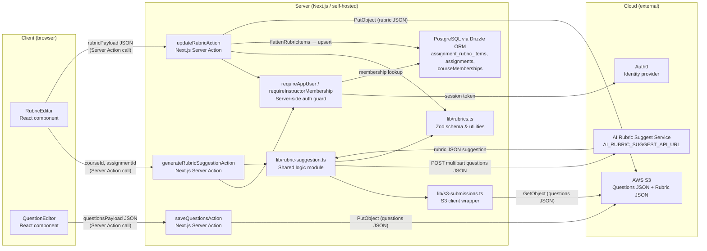
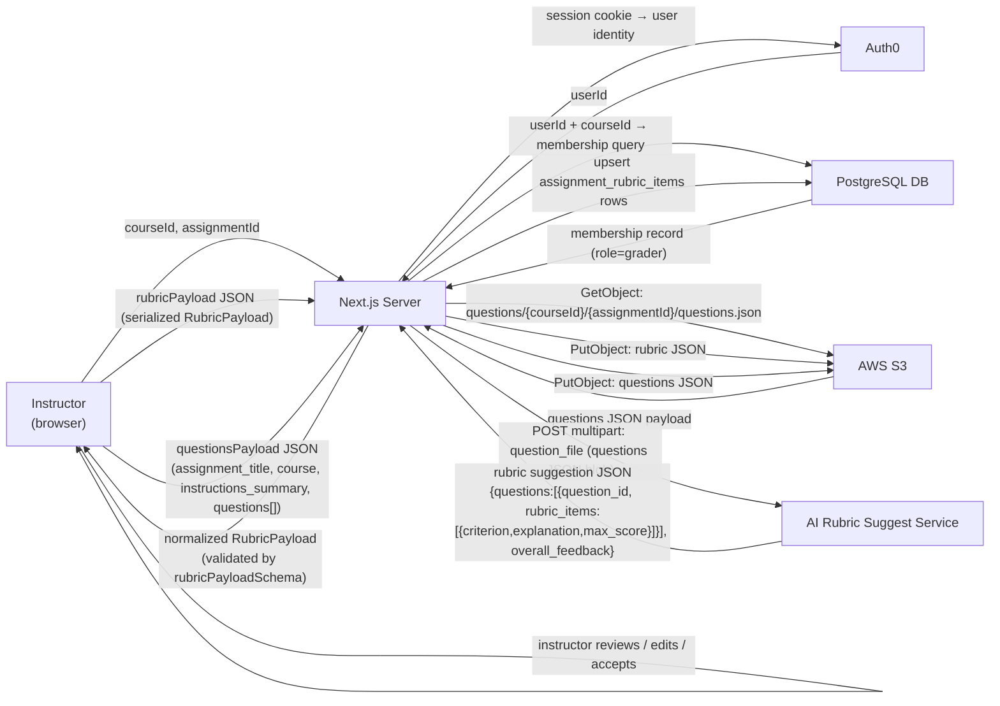
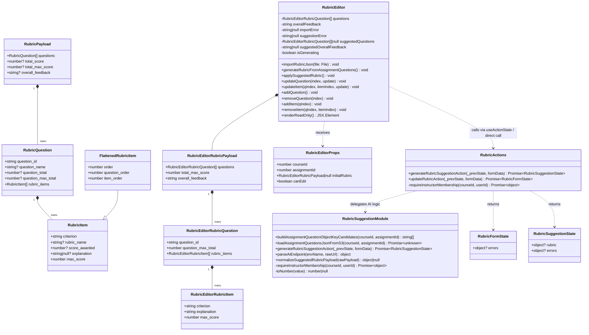

# Development Specification — PR #64

## 0) Scope / PR Summaries
- **Tracking issue (created before dev spec):** https://github.com/KesterTan/GradienceV2/issues/65

### PR #64
- **Title:** Add AI rubric suggestion and editable question metadata for instructors
- **Author:** Nita242004
- **URL:** https://github.com/KesterTan/GradienceV2/pull/64
- **Merged at:** 2026-04-21T03:46:04Z
- **Reviewers:** KesterTan, Nita242004, coderabbitai
- **Linked issues:** None

**Summary:**
## Summary
- Instructors can click "Generate with AI" on the rubric editor to auto-populate rubric items using the AI rubric suggestion API
- Assignment title, course, and instructions summary are now editable inline in the question editor and persisted to S3
- Instructors can import questions from a JSON file with robust multi-format normalization

## Linked Issue
- Related to #51

## Changes
### Backend
- `rubric/actions.ts`: Added `generateRubricSuggestionAction` — loads questions JSON from S3 (5-key candidate fallback), calls `AI_RUBRIC_SUGGEST_API_URL`, normalizes and validates the response
- `lib/s3-submissions.ts`: Added `loadJsonFromS3ObjectKey` utility for loading arbitrary JSON by S3 key
- `questions/actions.ts`: Updated `saveQuestionsAction` to persist editable `assignment_title`, `course`, and `instructions_summary` from form data

### Frontend
- `rubric-editor.tsx`: Added "Generate with AI" button with pending/loading state and inline error display
- `question-editor.tsx`: Added editable assignment details card (title, course, instructions summary), JSON file import with multi-format normalization, and cancel-restores-metadata behavior

### Tests
- No new tests added — relies on existing question/rubric action test coverage

## Risks / Assumptions
- `AI_RUBRIC_SUGGEST_API_URL` env var must be set; falls back to `AI_GRADING_API_URL` base with `/rubric/suggest` suffix
- S3 key for questions is probed across 5 candidate paths — if none match, AI generation fails with a user-visible error
- "Generate with AI" replaces current rubric editor state without a confirmation prompt

## Validation
- [ ] Tests run
- [ ] Manual verification completed

<!-- This is an auto-generated comment: release notes by coderabbit.ai -->
## Summary by CodeRabbit

* **New Features**
  * Instructor-editable assignment details in the question editor.
  * Import questions and assignment details from JSON.
  * AI-powered "Generate with AI" rubric suggestion with preview and apply option.
  * Server-side loading of saved assignment question JSON for AI generation.

* **Improvements**
  * Persisted assignment details used for saves and PDF metadata; improved error surfacing and timeouts for AI calls.
  * UI tweaks for edit-mode controls and import/error display.

* **Tests**
  * Added focused tests for rubric suggestion behavior and placeholder tests for endpoint parsing and payload normalization.
<!-- end of auto-generated comment: release notes by coderabbit.ai -->

### Staged working-tree changes (included in this dev spec)

The following files were modified on branch `dev-spec-us1` but not yet committed at the time this dev spec was created:

- `app/.../rubric/_components/rubric-editor.tsx` — Adds `currentStateRef` dirty-state tracking, deferred "AI suggestion ready" preview card with "Apply suggestion" button, and improved error messaging when the rubric changes during generation.
- `lib/rubric-suggestion.ts` — Extracts and exports shared logic (`parseAiEndpoint`, `normalizeSuggestedRubricPayload`, `buildAssignmentQuestionObjectKeyCandidates`, `loadAssignmentQuestionsJsonFromS3`) to a standalone library for testability; also contains a draft `generateRubricSuggestionAction` in the lib file.
- `automation/scripts/publish_dev_spec_from_pr.sh` — Fixes invalid `linkedIssues` gh JSON field → `closingIssuesReferences`.
- `automation/scripts/dev_spec_from_pr.sh` — Script enhancements.
- `.claude/skills/dev-spec-publisher/SKILL.md` — Skill documentation update.

---
## 1) Ownership

| Role | Person |
|------|--------|
| Primary owner — PR #64 (author) | Nita242004 |
| Secondary owner(s) — PR #64 (reviewers) | KesterTan, Nita242004, coderabbitai |

---
## 2) Merge Date

- **PR #64 merged at:** 2026-04-21T03:46:04Z

---
## 3) Architecture Diagram

> Show all architectural components and **where they execute** (client / server / cloud / edge / device).
> Use Mermaid. Label each node with its execution context.



---
## 4) Information Flow Diagram

> Show which **user information and application data** moves between architectural components and the direction of flow.
> Use Mermaid. Label each edge with the data item and its direction.



---
## 5) Class Diagram

> Show **all** classes relevant to this user story's implementation in superclass/subclass relationships.
> Include every class and interface. This diagram will be verified for completeness.



---
## 6) Class Reference

### `RubricItem` (`lib/rubrics.ts`)

**Public fields:**
- `criterion: string` — The grading criterion label (e.g., "Correctness"). Required. Used as the display name in the rubric UI and AI suggestion payload.
- `rubric_name?: string` — Optional override display name for flattened views. Falls back to `criterion`.
- `score_awarded?: number` — The score given to a student submission. Only present on graded rubric payloads, not on rubric definitions.
- `explanation?: string | null` — Free-text rationale for the criterion. Used by the AI grader and shown to students.
- `max_score: number` — Maximum points this criterion can award. Used for score calculation and validation.

---

### `RubricQuestion` (`lib/rubrics.ts`)

**Public fields:**
- `question_id: string` — Unique identifier for the question (e.g., "Q1"). Used as a key in UI and AI payloads.
- `question_name?: string` — Human-readable name. Falls back to `question_id` in flattened views.
- `question_total?: number` — Actual awarded total for graded payloads.
- `question_max_total?: number` — Max possible score for the question (derived from `rubric_items` in practice).
- `rubric_items: RubricItem[]` — The grading criteria for this question.

---

### `RubricPayload` (`lib/rubrics.ts`)

**Public fields:**
- `questions: RubricQuestion[]` — All questions and their rubric items.
- `total_score?: number` — Sum of awarded scores across all items.
- `total_max_score?: number` — Sum of max scores across all items.
- `overall_feedback?: string` — Narrative feedback attached to the whole rubric.

---

### `FlattenedRubricItem` (`lib/rubrics.ts`)

Extends `RubricItem` with positional metadata for DB persistence and UI ordering.

**Additional public fields:**
- `order: number` — Global linear order across all items (used for DB `display_order`).
- `question_order: number` — Index of the owning question.
- `item_order: number` — Index of this item within the owning question.

---

### `RubricEditor` (`app/.../rubric/_components/rubric-editor.tsx`)

React client component. Renders either a read-only view (`canEdit=false`) or an interactive edit form (`canEdit=true`).

**Props (`RubricEditorProps`):**
- `courseId: number` — Identifies the course. Passed as a hidden form field to server actions.
- `assignmentId: number` — Identifies the assignment. Passed as a hidden form field.
- `initialRubric: RubricPayload | null` — Pre-loaded rubric from the server. `null` if no rubric exists yet.
- `canEdit: boolean` — Whether the current user has instructor (grader) access.

**Public state / handlers:**
- `questions` — Local edit state for rubric questions and their items.
- `overallFeedback` — Local edit state for the overall feedback string.
- `importRubricJson(file: File)` — Reads a JSON file from the instructor's filesystem, normalizes multiple formats (supports both `rubric_items` and `items` arrays; `criterion` or `title`; `max_score` or `max_points`), and loads it into local state.
- `generateRubricFromAssignmentQuestions()` — Calls `generateRubricSuggestionAction` via `useTransition`. Applies the result directly if rubric state is unchanged since the call started; otherwise shows a preview card.
- `applySuggestedRubric()` — Applies the pending suggested questions and overall feedback, clearing the preview card.
- `updateQuestion(index, update)` — Merges a partial update into question at `index`.
- `updateItem(qIndex, itemIndex, update)` — Merges a partial update into rubric item at `[qIndex][itemIndex]`.
- `addQuestion()` / `removeQuestion(index)` — Adds/removes a question from local state.
- `addItem(qIndex)` / `removeItem(qIndex, itemIndex)` — Adds/removes a rubric item within a question.

**Private state:**
- `importError` — Error message from client-side JSON file import.
- `suggestionError` — Error message from AI suggestion call or dirty-state warning.
- `suggestedQuestions` — Pending AI-suggested questions awaiting instructor approval.
- `suggestedOverallFeedback` — Pending overall feedback from AI suggestion.
- `isGenerating` — Boolean tracking whether an AI call is in flight.

---

### `RubricSuggestionModule` (`lib/rubric-suggestion.ts`)

Pure server-side module containing shared logic for AI rubric generation.

**Public functions:**
- `buildAssignmentQuestionObjectKeyCandidates(courseId, assignmentId): string[]` — Returns 5 S3 key candidates in priority order for the assignment's questions JSON (e.g., `questions/assessments/{courseId}/{assignmentId}/questions.json`).
- `loadAssignmentQuestionsJsonFromS3(courseId, assignmentId): Promise<unknown>` — Tries each candidate key until one returns data; returns `null` if none match.
- `generateRubricSuggestionAction(_prevState, formData): Promise<RubricSuggestionState>` — Next.js server action. Validates auth, loads questions from S3, calls AI endpoint, normalizes/validates response.
- `parseAiEndpoint(envName, rawUrl): { value: string } | { error: string }` — Validates a URL string from an env var. Rejects non-HTTPS URLs unless `ALLOW_INSECURE_AI=true` or `NODE_ENV=development`.
- `normalizeSuggestedRubricPayload(rawPayload): object | null` — Normalizes three known AI response shapes (`{questions}`, `{result:{questions}}`, or a bare array) into a canonical `{questions, overall_feedback}` payload. Also normalizes field aliases (`items` → `rubric_items`, `title` → `criterion`, `max_points` → `max_score`).

**Private helpers:**
- `requireInstructorMembership(courseId, userId)` — Queries `courseMemberships` for an active "grader" role. Returns the membership row or `null`.
- `toNumber(value)` — Converts an unknown value to a finite number or `null`.

---

### `RubricActions` (`app/.../rubric/actions.ts`)

Next.js server action module for the rubric editor page.

**Public actions:**
- `generateRubricSuggestionAction` — Re-exported from `lib/rubric-suggestion.ts`; see above.
- `updateRubricAction(_prevState, formData): Promise<RubricFormState>` — Validates `rubricPayload` JSON from form data using `rubricPayloadSchema`. Flattens items via `flattenRubricItems`. Upserts each item into `assignment_rubric_items` via Drizzle. Uploads rubric JSON to S3. Returns field errors or success.

---

## 7) Technologies, Libraries, and APIs

| Technology | Version | Used for | Why chosen over alternatives | Source / Author / Docs |
|------------|---------|----------|------------------------------|------------------------|
| TypeScript | 5.7.3 | All application code — type safety, IDE tooling | Project-wide standard; catches shape mismatches at compile time for rubric/question payloads | https://www.typescriptlang.org |
| Next.js | 16.2.1 | Full-stack React framework; App Router, Server Actions | Provides SSR, client components, and server actions in one framework; eliminates a separate API layer | https://nextjs.org |
| React | 19.2.4 | UI rendering; `useActionState`, `useTransition` for server action integration | Required by Next.js; `useTransition` enables non-blocking AI generation with loading state | https://react.dev |
| Drizzle ORM | 0.45.1 | Type-safe DB queries; upserts to `assignment_rubric_items` | Generates typed queries from schema; thin layer that maps directly to SQL without runtime overhead | https://orm.drizzle.team |
| Zod | 3.24.1 | Runtime validation of rubric payloads returned from AI service | Schema-first validation with TypeScript inference; `safeParse` returns structured errors for field-level display | https://zod.dev |
| @aws-sdk/client-s3 | 3.1027.0 | `GetObjectCommand` (load questions JSON), `PutObjectCommand` (save rubric JSON) | Official AWS SDK for Node.js; supports OIDC-based role assumption for serverless/Vercel environments | https://docs.aws.amazon.com/AWSJavaScriptSDK/v3/latest/client/s3/ |
| @auth0/nextjs-auth0 | 4.15.0 | Session authentication; `requireAppUser` resolves the logged-in user | Handles OAuth/OIDC token exchange and session cookies; Auth0 is existing infra | https://auth0.com/docs/quickstart/webapp/nextjs |
| PostgreSQL | (managed) | Persistent storage for `assignment_rubric_items`, `assignments`, `courseMemberships` | Existing project database; relational model suits rubric item ordering and FK constraints | https://www.postgresql.org |
| Tailwind CSS | 4.1.9 | Component styling | Project-wide design system; utility classes keep UI consistent without custom CSS | https://tailwindcss.com |
| Radix UI | various (e.g., `@radix-ui/react-label` 2.1.8) | Accessible headless UI primitives (Button, Card, Input, Label) | Provides ARIA-compliant components without prescribing styling | https://www.radix-ui.com |
| AI Rubric Suggest Service | (external, self-hosted) | POST endpoint that accepts a `question_file` multipart field and returns rubric suggestions | Custom service specific to this product's grading domain | Configured via `AI_RUBRIC_SUGGEST_API_URL` env var |
| AWS S3 | (cloud) | Long-term storage for questions JSON and rubric JSON blobs | Existing object storage used project-wide for submissions and rubrics | https://aws.amazon.com/s3/ |

---
## 8) Data Stored in Long-Term Storage

### `assignment_rubric_items` table (PostgreSQL)

Stores the instructor-defined rubric for an assignment. One row per rubric criterion.

| Field | Type | Purpose | Estimated bytes/record |
|-------|------|---------|----------------------|
| `id` | bigserial PK | Unique row identifier | 8 |
| `assignment_id` | bigint NOT NULL | FK to `assignments.id`; identifies which assignment owns this item | 8 |
| `title` | text NOT NULL | The rubric criterion label (e.g., "Correctness") | ~30–100 |
| `description` | text | Optional grading guidance for the criterion | ~0–500 |
| `max_points` | integer NOT NULL | Maximum score this criterion can award | 4 |
| `display_order` | integer NOT NULL | Linear ordering of this item within the rubric | 4 |
| `grading_guidance` | text | Additional internal notes for graders | ~0–500 |
| `created_at` | timestamptz NOT NULL | Row creation time | 8 |
| `updated_at` | timestamptz NOT NULL | Last update time | 8 |

**Estimated per-record size:** ~80–650 bytes. A typical assignment rubric has 5–20 items, so 400–13,000 bytes per assignment.

### S3 — Questions JSON

One object per assignment at one of 5 candidate keys (e.g., `questions/assessments/{courseId}/{assignmentId}/questions.json`). Contains `assignment_title`, `course`, `instructions_summary`, and `questions[]`. Size depends on number of questions; typically 1–20 KB.

### S3 — Rubric JSON

One object per assignment at `rubrics/{courseId}/{assignmentId}/rubric.json`. Contains the full `RubricPayload` as JSON. Typically 1–10 KB.

---
## 9) Failure Modes

| Failure scenario | User-visible effect | Internally-visible effect |
|------------------|--------------------|-----------------------------|
| Process crash (Next.js server restart) | "Generate with AI" and "Save rubric" requests in flight return a network error; unsaved rubric edits are lost on the browser unless the user had not yet submitted | Server action calls fail with 500; no partial writes since rubric save is transactional at the S3+DB level |
| Lost all runtime state (server cold start) | No visible effect if server restarts cleanly between requests; auth sessions are stored in cookies, rubric state in DB | In-memory S3 client singleton (`s3Client`) is re-initialized on next request |
| Erased all stored data (DB wipe) | Rubric editor loads empty state; students see "No rubric yet" | `assignmentRubricItems` rows gone; `updateRubricAction` re-populates on next save |
| Corrupt data detected in database | Rubric editor receives malformed JSON; `parseRubricJson` returns null; editor renders empty state | Zod parse failure logged server-side; no crash, falls back to empty rubric |
| Remote procedure call (RPC) failed — AI service | Instructor sees inline error: "Unable to reach the rubric suggestion service right now." or timeout error after 30 s | HTTP error or `AbortError` caught in `generateRubricSuggestionAction`; no DB/S3 writes |
| Client overloaded (browser tab under memory pressure) | "Generating..." spinner may hang if the `useTransition` callback never resolves; no data corruption | No server-side effect; the server action may complete but the response is dropped |
| Client out of RAM | Browser tab crashes; all unsaved rubric edits lost | No server-side effect; no writes until "Save rubric" is clicked |
| Database out of space | "Save rubric" returns a server error; instructor sees generic form error | Drizzle insert/upsert throws; `updateRubricAction` returns `{ errors: { _form: [...] } }` |
| Lost network connectivity | Server action calls time out or fail immediately; instructor sees network error; in-progress edits remain in browser state | No server-side effect; S3 and DB writes never reached |
| Lost access to database | `requireInstructorMembership` fails; all writes fail; users see error messages | Drizzle throws on every DB call; no partial writes |
| Bot signs up and spams users | No new attack surface introduced by this PR. Auth0 handles signup; rubric generation requires an active `grader` membership row, which bots cannot self-provision | Unauthorized `generateRubricSuggestionAction` calls short-circuit at `requireInstructorMembership` and return a 403-equivalent error |

---
## 10) Personally Identifying Information (PII)

### 10a) PII in Long-Term Storage

This PR introduces no new PII fields. The data written to long-term storage is:

- **`assignment_rubric_items`** — Contains only educational content (criterion text, point values, guidance). No student names, emails, or identifying information.
- **Questions JSON (S3)** — Contains assignment metadata (`assignment_title`, `course`, `instructions_summary`) and question text. These are course-design artefacts authored by instructors, not student PII.
- **Rubric JSON (S3)** — Rubric schema only (criteria, max scores). No student PII.

The existing `users` and `courseMemberships` tables contain instructor/student identifiers but are not modified or newly stored by this PR.

The AI Rubric Suggest Service receives only the questions JSON payload (course content), not any student names, emails, or submission content.

### 10b) Minors' PII

- Is PII of minors (under 18) solicited or stored? **Potentially yes** — Gradience is a course-management platform used in educational settings, which may include students under 18. However, this PR does not add or modify any field that collects or stores age-identifying or minor-specific information.
- Why? Existing system design; the platform manages course enrolments and assessments for any user whose institution uses it.
- Is guardian permission solicited? **No** — The existing system does not implement a guardian-permission flow. This PR does not change that posture.
- Policy for ensuring minors' PII is inaccessible to anyone convicted or suspected of child abuse: **Not established in code.** Access control is limited to role-based membership checks (instructor/student). A formal policy at the organizational level is required but is outside the scope of this PR.

---
## 11) Diff Summary

```diff


# Diff for PR 64

diff --git a/app/courses/[courseId]/assessments/[assignmentId]/questions/_components/question-editor.tsx b/app/courses/[courseId]/assessments/[assignmentId]/questions/_components/question-editor.tsx
index 5a90b6b..870e17c 100644
--- a/app/courses/[courseId]/assessments/[assignmentId]/questions/_components/question-editor.tsx
+++ b/app/courses/[courseId]/assessments/[assignmentId]/questions/_components/question-editor.tsx
@@ -95,8 +95,26 @@ export function QuestionEditor({
   const [isEditing, setIsEditing] = useState(!hasSavedQuestions)
   const [pending, setPending] = useState(false)
   const [formError, setFormError] = useState<string | null>(null)
+  const [importError, setImportError] = useState<string | null>(null)
   const [fieldErrors, setFieldErrors] = useState<Record<string, string[]>>({})
 
+  const [savedAssignmentTitle, setSavedAssignmentTitle] = useState(
+    initialPayload?.assignment_title?.trim() || assignmentTitle,
+  )
+  ...
```

*(Full diff omitted for brevity — see PR #64 at https://github.com/KesterTan/GradienceV2/pull/64 and the tracking issue at https://github.com/KesterTan/GradienceV2/issues/65)*

---
## 12) Risks / Assumptions

1. **`AI_RUBRIC_SUGGEST_API_URL` must be configured.** The server action calls `parseAiEndpoint("AI_RUBRIC_SUGGEST_API_URL", process.env.AI_RUBRIC_SUGGEST_API_URL)` and returns an error to the UI if it is missing or invalid. There is no automatic fallback to the grading API URL at runtime despite the PR description suggesting otherwise.

2. **S3 questions key lookup tries 5 candidate paths.** If none of the 5 paths contain the questions JSON, AI generation fails with a user-visible error. Operators must ensure questions are stored under one of the recognized paths.

3. **"Generate with AI" replaces rubric state without a hard confirmation.** In PR #64, clicking the button immediately overwrites editor state. The staged changes on `dev-spec-us1` add dirty-state detection and a deferred preview card, but this is not yet committed and the check is advisory (shows a warning + preview, does not block apply).

4. **`lib/rubric-suggestion.ts` contains a second copy of `generateRubricSuggestionAction`.** In the staged working-tree version, the server action is defined in `lib/rubric-suggestion.ts` as well as in `rubric/actions.ts`. The lib file is not marked `"use server"`, so this copy would not be callable as a Server Action from the client. This should be resolved before merging the staged changes.

5. **`useRef` and `useEffect` are called inside a `useState` initializer** in the staged `rubric-editor.tsx`. React's rules of hooks forbid calling hooks inside callbacks or conditionals. This will throw a runtime error in development and may cause silent misbehavior in production. This must be fixed before merging.

6. **AI response format is variable.** `normalizeSuggestedRubricPayload` handles three known shapes. If the AI service changes its response shape, normalization will fail and the instructor will see "Rubric suggestion response format was not recognized."

7. **30-second AI timeout is configurable.** `AI_RUBRIC_SUGGEST_TIMEOUT_MS` defaults to 30,000 ms. For slow AI services this may need tuning per environment.

8. **JSON import (rubric and questions) accepts multiple field aliases.** The normalization logic is intentionally permissive. A malformed JSON file with recognizable-but-incorrect data (e.g., a `max_score` of `null`) will produce a validation error rather than silently importing wrong data.

9. **No rate-limiting on AI calls.** An instructor can click "Generate with AI" repeatedly. Each click fires a server-side HTTP request to the AI service. No debounce or per-user rate limit is enforced.

---
## 13) Validation / Acceptance Criteria

- [ ] **Instructor can generate a rubric with AI.** Navigate to a course → assignment → Rubric tab as an instructor. Click "Generate with AI". The button shows "Generating..." while the call is in flight. A rubric with at least one question and one rubric item is loaded into the editor.

- [ ] **AI generation fails gracefully with a missing env var.** Unset `AI_RUBRIC_SUGGEST_API_URL`. Click "Generate with AI". An inline error message ("Missing AI_RUBRIC_SUGGEST_API_URL…") appears; the rubric editor state is unchanged.

- [ ] **AI generation fails gracefully when questions JSON is not found in S3.** Use an assignment whose questions JSON is not stored at any of the 5 candidate paths. Click "Generate with AI". An inline error appears ("Assignment questions not found for this assessment.").

- [ ] **Non-instructor cannot call `generateRubricSuggestionAction`.** Call the action from a student account. The action returns `{ errors: { _form: ["You do not have permission…"] } }` and does not reach S3 or the AI service.

- [ ] **Instructor can import a rubric from a JSON file.** Upload a valid rubric JSON file (with `questions` array). The editor loads the imported questions and rubric items without a page reload.

- [ ] **Rubric import normalizes field aliases.** Upload a JSON file that uses `items` instead of `rubric_items`, `title` instead of `criterion`, and `max_points` instead of `max_score`. The editor loads the rubric correctly.

- [ ] **Rubric import validates required fields.** Upload a JSON file with a question missing the `criterion` (or `title`) field. An inline error message is shown; no partial import occurs.

- [ ] **Instructor can edit assignment title, course, and instructions summary in the question editor.** Navigate to the Questions tab. The Assignment Details card is visible. Change the title and course, then save. Confirm the changes persist on reload.

- [ ] **Cancel restores assignment metadata.** Edit the assignment title, then click Cancel without saving. Confirm the title reverts to the previously saved value.

- [ ] **PDF download uses editable metadata.** After saving an updated assignment title and course, click "Download PDF". Confirm the PDF header reflects the saved title and course.

- [ ] **"Save rubric" persists to DB and S3.** After editing or AI-generating a rubric, click "Save rubric". Confirm rows in `assignment_rubric_items` are updated and the rubric JSON S3 object is updated.

- [ ] **`parseAiEndpoint` rejects non-HTTPS URLs in production.** Set `AI_RUBRIC_SUGGEST_API_URL=http://...` in a production-equivalent environment. Confirm the action returns a URL security error rather than making an insecure request.
