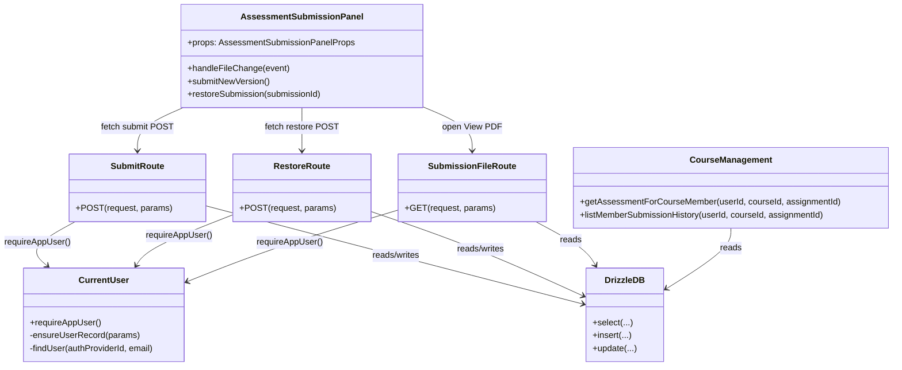

# Development Specification — Submissions (Student PDF Upload)

## 0) Scope / user story
**User story in scope:** *As a student, I want to upload a PDF for an assignment so that I can turn in my work.*

**In-scope behaviors (as implemented in this repo today):**
- Upload a **PDF** (<= **25 MB**) from the assessment page.
- Create a **`submissions`** row linked to the current user’s **course membership** and the **assignment**.
- Store the uploaded PDF on the server under `public/uploads/...` and make it retrievable via an authenticated file route.
- Display submission history (attempts) and allow restoring a previous version (creates a new attempt pointing at the prior file URL).

**Out of scope (not implemented today):**
- S3 storage (the code supports redirecting to external file URLs, but the write path is local filesystem).
- Multiple file attachments per submission (DB has `submission_files` in `schema.sql`, but current routes only write `submissions.file_url`).
- Plagiarism / virus scanning.
- Rate limiting / abuse prevention controls (not present in the submission upload route).

---

## 0.1) Ownership and merge metadata
- **Primary owner (by git authorship of PR #18 commit):** `preeyaX`
- **Secondary owner (by git authorship on submission pipeline files):** `kesterTan`
- **Date merged into `main`:** **2026-03-26**
  - Evidence: commit `0f53760` — *`[NEW] Submit an Assignment, View Submission History, and Restore Previous Submissions (#18) -> merging to main`*

> Note: “owner” isn’t explicitly defined in-repo; the owners above are inferred from git authorship of the submission feature’s merge commit and subsequent edits.

---

## 1) Architecture diagram (Mermaid, with execution locations)
```mermaid
flowchart LR
  subgraph ClientEnv[Client environment - Browser]
    U[Student user]
    UI[Next.js rendered UI (React)]
  end

  subgraph ServerEnv[Server environment - Node.js (Next.js App Router)]
    SSR[App Router pages / RSC]
    API1[POST /api/courses/:courseId/assessments/:assignmentId/submit]
    API2[POST /api/courses/:courseId/assessments/:assignmentId/restore]
    API3[GET /api/courses/:courseId/assessments/:assignmentId/submissions/:submissionId/file]
    FS[(Local filesystem: public/uploads)]
  end

  subgraph DataEnv[Data environment - PostgreSQL]
    DB[(Postgres DB)]
    TUsers[users]
    TMemberships[course_memberships]
    TAssignments[assignments]
    TSubmissions[submissions]
  end

  subgraph AuthEnv[Auth environment - Auth0]
    Auth0[Auth0 session]
  end

  U --> UI
  UI -->|navigate| SSR
  SSR -->|read course/assessment data| DB
  SSR -->|requireAppUser session lookup| Auth0

  UI -->|multipart/form-data PDF| API1
  API1 -->|validate membership + assignment| DB
  API1 -->|write PDF bytes| FS
  API1 -->|insert submission row| TSubmissions

  UI -->|restore request JSON| API2
  API2 -->|read submissions + insert new attempt| TSubmissions

  UI -->|open PDF in new tab / iframe| API3
  API3 -->|authorize + read submission| DB
  API3 -->|read file bytes| FS

  DB --- TUsers
  DB --- TMemberships
  DB --- TAssignments
  DB --- TSubmissions
```

**Key execution boundaries (current implementation):**
- **Client**: file selection UX + pre-validation + submission triggers
- **Server**: authorization, attempt/deadline enforcement, file write, DB insert, file serving
- **Database**: stores relationships + submission metadata
- **Local storage**: stores the actual PDF bytes under `public/uploads/...`

---

## 2) Information flow diagram (Mermaid, data + direction)
```mermaid
flowchart TD
  Student[Student] -->|selects PDF bytes| Browser[Browser UI]

  Browser -->|Auth0 cookies and session| Auth0[Auth0 session]
  Browser -->|GET assessment page| App[Next.js server RSC]

  App -->|requireAppUser identity fields| Auth0
  Auth0 -->|session user claims| App
  App -->|ensure user row in users| DB[(Postgres DB)]

  App -->|assessment + membership| DB
  DB -->|assignment fields + membership role/status| App

  Browser -->|POST multipart: file=PDF| SubmitAPI[Submit route handler]
  SubmitAPI -->|course_memberships lookup (active)| DB
  SubmitAPI -->|assignments lookup| DB
  SubmitAPI -->|attempt count query| DB
  SubmitAPI -->|write bytes to public/uploads/...| FS[(Filesystem)]
  SubmitAPI -->|INSERT submissions row fields| DB
  SubmitAPI -->|JSON success or error| Browser

  Browser -->|refresh page| App
  App -->|listMemberSubmissionHistory| DB
  DB -->|attempt history rows| App
  App -->|render history and View PDF links| Browser

  Browser -->|GET /file route| FileAPI[File route handler]
  FileAPI -->|authorize (active membership + owner/grader)| DB
  FileAPI -->|read bytes from public/...| FS
  FileAPI -->|PDF bytes inline| Browser
```

**Primary user/application data moved:**
- **PDF bytes** (client → server → filesystem)
- **User identity claims** (Auth0 session → server)
- **Membership/assignment metadata** (server ↔ DB)
- **Submission metadata** (attempt number, submitted time, status, file URL) (server → DB)

---

## 3) Class diagram (Mermaid, superclass/subclass relationships)
This feature is implemented primarily with **functions** (React function components, App Router route handlers, and utility functions). There are **no first-party `class` declarations** in the submission pipeline. The diagram below treats each exported module/component as a “class-like unit” and uses associations (composition/usage) rather than inheritance.



---

## 4) “Class” inventory with fields/methods (public first, private second; grouped by concept)

### A) Client UX orchestration
#### `AssessmentSubmissionPanel` (`components/assessment-submission-panel.tsx`)
**Public fields/methods (exported / externally visible)**
- **Component API (props)**
  - `courseId: number`: identifies the course for route construction.
  - `assignmentId: number`: identifies the assessment being submitted.
  - `assignmentTitle: string`: displayed to the user for context.
  - `dueAt: string`: deadline used to disable uploads for students.
  - `lateUntil: string | null`: optional late window (students only).
  - `totalPoints: number`: informational display.
  - `allowResubmissions: boolean`: affects client-side attempt cap messaging.
  - `maxAttemptResubmission: number`: affects attempt cap.
  - `history: MemberSubmissionHistoryItem[]`: submission attempts shown in UI.
  - `isInstructor?: boolean`: toggles deadline enforcement and grader-oriented UX.
- **User-triggered behaviors**
  - `handleFileChange(event)`: validates selection (PDF + size) and stores `selectedFile`.
  - `submitNewVersion()`: uploads selected file via `fetch(POST submit)`.
  - `restoreSubmission(submissionId)`: requests restore via `fetch(POST restore)`.

**Private fields/methods (module-internal / non-exported)**
- **Constraints**
  - `MAX_FILE_SIZE_BYTES = 25 * 1024 * 1024`: max upload size (25 MB).
- **State**
  - `selectedFile: File | null`: currently chosen file.
  - `errorMessage: string | null`: user-visible error feedback.
  - `infoMessage: string | null`: user-visible success feedback.
  - `isSubmitting: boolean`: prevents double-submit.
  - `restoringSubmissionId: number | null`: prevents multi-restore.
- **Styling helper**
  - `statusStyles(status, isInstructor)`: maps statuses to badge styles.

---

### B) Server-side submission creation
#### `SubmitRoute` (`app/api/courses/[courseId]/assessments/[assignmentId]/submit/route.ts`)
**Public fields/methods**
- `runtime = "nodejs"`: forces Node runtime (required for `fs` write).
- `POST(request, { params })`: route handler for upload.
  - Validates route params (`courseId`, `assignmentId`).
  - Authenticates user via `requireAppUser()`.
  - Authorizes active course membership (`course_memberships.status = 'active'`).
  - Loads assignment deadline + resubmission settings.
  - Enforces deadline/late rules for students; graders bypass deadlines.
  - Enforces attempt cap using `max(submissions.attempt_number)`.
  - Validates PDF type and size.
  - Writes PDF into `public/uploads/submissions/{assignmentId}/{membershipId}/...pdf`.
  - Inserts a `submissions` row with `file_url` pointing at the stored path.
  - Returns `{ success: true }` or `{ error: string }` with HTTP status.

**Private fields/methods**
- `MAX_FILE_SIZE_BYTES`: 25 MB, mirrored with the client.
- File path construction details (relative/absolute paths).

---

### C) Server-side “restore” (create a new attempt from a prior file URL)
#### `RestoreRoute` (`app/api/courses/[courseId]/assessments/[assignmentId]/restore/route.ts`)
**Public fields/methods**
- `POST(request, { params })`:
  - Authenticates user via `requireAppUser()`.
  - Requires active membership.
  - Loads assignment deadlines.
  - If student: only allows restore of their own submission; graders can restore any student’s.
  - Enforces deadline/late rules for students; graders bypass deadlines.
  - Inserts a new `submissions` row with:
    - `attempt_number = max(existing)+1`
    - `file_url = sourceSubmission.file_url` (reuses file reference)

**Private fields/methods**
- JSON body parsing (`submissionId`) and related validation.

---

### D) Server-side file retrieval
#### `SubmissionFileRoute` (`app/api/courses/[courseId]/assessments/[assignmentId]/submissions/[submissionId]/file/route.ts`)
**Public fields/methods**
- `runtime = "nodejs"`: required for filesystem reads.
- `GET(_request, { params })`:
  - Authenticates user via `requireAppUser()`.
  - Requires active membership.
  - Authorizes access:
    - student can access only their own submission file
    - grader can access any submission file in the course
  - If `file_url` starts with `http(s)://`: redirects to external storage URL.
  - Else reads file from `public/...` and returns bytes with:
    - `Content-Type: application/pdf`
    - `Content-Disposition: inline`
    - `Cache-Control: private, no-store`

**Private fields/methods**
- Path normalization and traversal protections:
  - Rejects non-absolute (non-`/`-prefixed) file URLs.
  - Uses `path.normalize()` and checks resolved absolute path stays under `public/`.

---

### E) DB access helpers relevant to the submission UI
#### `CourseManagement` (`lib/course-management.ts`)
**Public fields/methods**
- `getAssessmentForCourseMember(userId, courseId, assignmentId)`:
  - Returns assessment fields + viewer role (Student vs Instructor) for active members.
- `listMemberSubmissionHistory(userId, courseId, assignmentId)`:
  - Returns the caller’s submissions for that assignment by joining:
    - `submissions.student_membership_id = my_membership.id`
    - `my_membership.status = 'active'`
  - Provides derived `isCurrent` (latest attempt).

**Private fields/methods**
- Query construction details (aliases, joins, `sql<>` computed fields).

---

### F) Authentication + user hydration
#### `CurrentUser` (`lib/current-user.ts`)
**Public fields/methods**
- `requireAppUser()`:
  - Reads Auth0 session and redirects to `/login` if missing.
  - Ensures a row exists in `users` (find or create).
  - Returns `{ id, firstName, lastName, email }`.

**Private fields/methods**
- `splitName(name, email)`:
  - Determines `firstName`/`lastName` from session name or email prefix.
- `findUser(authProviderId, email)`:
  - Locates a user by `auth_provider_id` or case-insensitive email.
- `ensureUserRecord({ authProviderId, email, name })`:
  - Creates a user record if missing; updates `auth_provider_id` if needed.

---

## 5) External technologies/libraries/APIs (versions, purpose, rationale, source, author, docs)
This table lists **all** third-party dependencies declared in `package.json` (runtime and dev), plus the core platform technologies they imply.

> “Why chosen” reflects typical engineering tradeoffs; it does not imply the team evaluated every alternative formally.

| Technology | Required version (repo) | Used for | Why chosen over others | Source | Author / org | Docs |
|---|---:|---|---|---|---|---|
| Node.js | (not pinned in repo) | Server runtime for Next.js + route handlers | Standard for Next.js | `https://nodejs.org/` | OpenJS Foundation | `https://nodejs.org/en/docs` |
| TypeScript | `5.7.3` | Static typing | Safer refactors, editor tooling | `https://www.typescriptlang.org/` | Microsoft | `https://www.typescriptlang.org/docs/` |
| Next.js | `16.2.1` | App Router pages + API route handlers | Full-stack React framework with server rendering | `https://github.com/vercel/next.js` | Vercel | `https://nextjs.org/docs` |
| React | `19.2.4` | UI rendering | Ecosystem + Next.js default | `https://github.com/facebook/react` | Meta | `https://react.dev/` |
| React DOM | `19.2.4` | DOM renderer | Required for React web apps | `https://github.com/facebook/react` | Meta | `https://react.dev/reference/react-dom` |
| @auth0/nextjs-auth0 | `^4.15.0` | Auth0 session handling | Turnkey Auth0 integration for Next.js | `https://github.com/auth0/nextjs-auth0` | Auth0 | `https://auth0.com/docs/quickstart/webapp/nextjs` |
| drizzle-orm | `^0.45.1` | Typed SQL/ORM | Type-safe queries, light abstraction | `https://github.com/drizzle-team/drizzle-orm` | Drizzle Team | `https://orm.drizzle.team/docs/overview` |
| pg | `^8.20.0` | Postgres driver | Common Node Postgres client | `https://github.com/brianc/node-postgres` | Brian Carlson | `https://node-postgres.com/` |
| zod | `^3.24.1` | Runtime validation (used elsewhere in repo) | TS-friendly schemas | `https://github.com/colinhacks/zod` | Colin McDonnell | `https://zod.dev/` |
| date-fns | `4.1.0` | Date formatting in UI | Small, functional date utilities | `https://github.com/date-fns/date-fns` | date-fns contributors | `https://date-fns.org/` |
| lucide-react | `^0.564.0` | Icons | Simple icon library | `https://github.com/lucide-icons/lucide` | Lucide | `https://lucide.dev/` |
| @vercel/analytics | `1.6.1` | Analytics (optional) | Vercel integration | `https://github.com/vercel/analytics` | Vercel | `https://vercel.com/docs/analytics` |
| @vercel/functions | `^3.4.3` | Vercel functions helpers | Vercel platform integration | `https://github.com/vercel/vercel` | Vercel | `https://vercel.com/docs/functions` |
| vercel | `^50.35.0` | Vercel CLI | Deploy/preview tooling | `https://github.com/vercel/vercel` | Vercel | `https://vercel.com/docs/cli` |
| dotenv | `^16.4.7` | Env var loading (scripts) | Standard env loader | `https://github.com/motdotla/dotenv` | motdotla | `https://github.com/motdotla/dotenv#readme` |
| tsx | `^4.7.2` | Run TS scripts | Ergonomic TS script runner | `https://github.com/esbuild-kit/tsx` | esbuild-kit | `https://github.com/esbuild-kit/tsx#readme` |
| vitest | `^2.1.9` | Unit tests | Fast Vite-based test runner | `https://github.com/vitest-dev/vitest` | Vitest | `https://vitest.dev/` |
| vite-tsconfig-paths | `^5.1.4` | TS path aliases in tests | Less import boilerplate | `https://github.com/aleclarson/vite-tsconfig-paths` | Alec Larson | `https://github.com/aleclarson/vite-tsconfig-paths#readme` |
| Tailwind CSS | `^4.1.9` | Styling | Utility-first styling | `https://github.com/tailwindlabs/tailwindcss` | Tailwind Labs | `https://tailwindcss.com/docs` |
| postcss | `^8.5` | CSS processing | Tailwind dependency | `https://github.com/postcss/postcss` | PostCSS | `https://postcss.org/` |
| @tailwindcss/postcss | `^4.1.13` | Tailwind PostCSS plugin | Tailwind v4 integration | `https://github.com/tailwindlabs/tailwindcss` | Tailwind Labs | `https://tailwindcss.com/docs/installation` |
| autoprefixer | `^10.4.20` | CSS vendor prefixes | Common PostCSS plugin | `https://github.com/postcss/autoprefixer` | Autoprefixer | `https://github.com/postcss/autoprefixer#readme` |
| clsx | `^2.1.1` | Conditional classnames | Small + common | `https://github.com/lukeed/clsx` | Luke Edwards | `https://github.com/lukeed/clsx#readme` |
| tailwind-merge | `^3.3.1` | Merge Tailwind classes | Avoid conflicting utilities | `https://github.com/dcastil/tailwind-merge` | David Castillo | `https://github.com/dcastil/tailwind-merge#readme` |
| class-variance-authority | `^0.7.1` | Variant-based styling | Patterns for component variants | `https://github.com/joe-bell/cva` | Joe Bell | `https://cva.style/docs` |
| tw-animate-css | `1.3.3` | Animation utilities | Tailwind animation convenience | `https://github.com/jamiebuilds/tw-animate-css` | Jamie Builds | `https://github.com/jamiebuilds/tw-animate-css` |
| next-themes | `^0.4.6` | Theme toggling | Common Next theme solution | `https://github.com/pacocoursey/next-themes` | Paco | `https://github.com/pacocoursey/next-themes#readme` |
| @hookform/resolvers | `^3.9.1` | Form schema resolvers | Common RHF companion | `https://github.com/react-hook-form/resolvers` | React Hook Form | `https://react-hook-form.com/docs/useform/#resolver` |
| react-hook-form | `^7.54.1` | Form handling | Mature form library | `https://github.com/react-hook-form/react-hook-form` | React Hook Form | `https://react-hook-form.com/` |
| sonner | `^1.7.1` | Toast notifications | Simple toast lib | `https://github.com/emilkowalski/sonner` | Emil Kowalski | `https://sonner.emilkowal.ski/` |
| cmdk | `1.1.1` | Command palette UI | Polished command menu | `https://github.com/pacocoursey/cmdk` | Paco | `https://cmdk.paco.me/` |
| vaul | `^1.1.2` | Drawer UI | Mobile-friendly drawers | `https://github.com/emilkowalski/vaul` | Emil Kowalski | `https://vaul.emilkowal.ski/` |
| embla-carousel-react | `8.6.0` | Carousel UI | Lightweight carousel | `https://github.com/davidjerleke/embla-carousel` | David Jerleke | `https://www.embla-carousel.com/` |
| input-otp | `1.4.2` | OTP inputs | Purpose-built OTP UI | `https://github.com/guilhermerodz/input-otp` | Guilherme Rodz | `https://github.com/guilhermerodz/input-otp` |
| react-day-picker | `9.13.2` | Date picker | Popular date picker | `https://github.com/gpbl/react-day-picker` | React Day Picker | `https://react-day-picker.js.org/` |
| react-resizable-panels | `^2.1.7` | Split panes | Resizable layouts | `https://github.com/bvaughn/react-resizable-panels` | Brian Vaughn | `https://github.com/bvaughn/react-resizable-panels#readme` |
| recharts | `2.15.0` | Charts | Popular React charts | `https://github.com/recharts/recharts` | Recharts | `https://recharts.org/en-US/` |
| @aws-sdk/rds-signer | `^3.1013.0` | AWS RDS IAM auth (DB) | Avoid static DB passwords | `https://github.com/aws/aws-sdk-js-v3` | AWS | `https://docs.aws.amazon.com/AWSJavaScriptSDK/v3/latest/` |
| @types/node | `^22` | TS Node types | Dev typing | `https://github.com/DefinitelyTyped/DefinitelyTyped` | DefinitelyTyped | `https://www.typescriptlang.org/docs/handbook/declaration-files/consumption.html` |
| @types/pg | `^8.11.6` | TS typings for `pg` | Dev typing | `https://github.com/DefinitelyTyped/DefinitelyTyped` | DefinitelyTyped | `https://node-postgres.com/features/typescript` |
| @types/react | `19.2.14` | TS typings for React | Dev typing | `https://github.com/DefinitelyTyped/DefinitelyTyped` | DefinitelyTyped | `https://react.dev/learn/typescript` |
| @types/react-dom | `19.2.3` | TS typings for React DOM | Dev typing | `https://github.com/DefinitelyTyped/DefinitelyTyped` | DefinitelyTyped | `https://react.dev/learn/typescript` |
| Radix UI packages | (see `package.json`) | Accessible primitives (dialogs, menus, etc.) | Good accessibility defaults | `https://github.com/radix-ui/primitives` | WorkOS / Radix | `https://www.radix-ui.com/primitives/docs/overview/introduction` |

**Radix UI package list (declared in `package.json`):**
- `@radix-ui/react-accordion@1.2.12`
- `@radix-ui/react-alert-dialog@1.1.15`
- `@radix-ui/react-aspect-ratio@1.1.8`
- `@radix-ui/react-avatar@1.1.11`
- `@radix-ui/react-checkbox@1.3.3`
- `@radix-ui/react-collapsible@1.1.12`
- `@radix-ui/react-context-menu@2.2.16`
- `@radix-ui/react-dialog@1.1.15`
- `@radix-ui/react-dropdown-menu@2.1.16`
- `@radix-ui/react-hover-card@1.1.15`
- `@radix-ui/react-label@2.1.8`
- `@radix-ui/react-menubar@1.1.16`
- `@radix-ui/react-navigation-menu@1.2.14`
- `@radix-ui/react-popover@1.1.15`
- `@radix-ui/react-progress@1.1.8`
- `@radix-ui/react-radio-group@1.3.8`
- `@radix-ui/react-scroll-area@1.2.10`
- `@radix-ui/react-select@2.2.6`
- `@radix-ui/react-separator@1.1.8`
- `@radix-ui/react-slider@1.3.6`
- `@radix-ui/react-slot@1.2.4`
- `@radix-ui/react-switch@1.2.6`
- `@radix-ui/react-tabs@1.1.13`
- `@radix-ui/react-toast@1.2.15`
- `@radix-ui/react-toggle@1.1.10`
- `@radix-ui/react-toggle-group@1.1.11`
- `@radix-ui/react-tooltip@1.2.8`

---

## 6) Long-term storage (database) data types and byte sizing
This feature persists data in two long-term stores:
1) **Postgres** (structured metadata + relationships)
2) **Filesystem** (actual PDF bytes under `public/uploads/...`)

### 6.1) Database datatypes used by this feature
The following tables/fields are read or written in the submission pipeline:

#### A) `submissions` (`gradience.submissions`) — **written by submit/restore routes**
Source: `db/schema.ts` (Drizzle), stored in Postgres.

| Field | Postgres type (logical) | Purpose | Approx bytes (data only) |
|---|---|---|---:|
| `id` | `bigserial` | Primary key | 8 |
| `assignment_id` | `bigint` | Links submission to assignment | 8 |
| `student_membership_id` | `bigint` | Links submission to course membership (student) | 8 |
| `attempt_number` | `int` | Version counter per student per assignment | 4 |
| `submitted_at` | `timestamptz` | Submission timestamp | 8 |
| `status` | `text` | `"submitted"` / `"late"` | ~ (4 + N)\* |
| `text_content` | `text` | Reserved for text submissions (currently `null` for PDFs) | 0 (null) |
| `file_url` | `text` | Stored file path (e.g. `/uploads/submissions/...pdf`) | ~ (4 + N)\* |
| `ai_processed_status` | `text` | Processing state (defaults `"awaiting"`) | ~ (4 + N)\* |
| `created_at` | `timestamptz` | Row creation time | 8 |
| `updated_at` | `timestamptz` | Row update time | 8 |

\* For Postgres `text`, the payload is variable-sized. A useful approximation is:
- **\(4 + N\)** bytes for a short varlena header + \(N\) bytes of UTF‑8 text (for small values).
  - Example: `status = "submitted"` is \(4 + 9\) bytes ≈ **13 bytes** of payload (not counting tuple/page overhead).
  - Example: a typical `file_url` of ~100 characters is \(4 + 100\) ≈ **104 bytes** of payload.

#### B) `course_memberships` (`gradience.course_memberships`) — **read for authorization**
Used to verify: membership exists and `status = 'active'`, plus role for gating.

Key fields used by routes:
- `id` (bigserial, 8 bytes) — used as `student_membership_id`
- `course_id` (bigint, 8 bytes)
- `user_id` (bigint, 8 bytes)
- `role` (text, variable) — `"student"` / `"grader"`
- `status` (text, variable) — `"active"` / etc

#### C) `assignments` (`gradience.assignments`) — **read for due dates + attempt rules**
Key fields used by routes:
- `id` (bigserial, 8 bytes)
- `course_id` (bigint, 8 bytes)
- `due_at` (timestamptz, 8 bytes)
- `late_until` (timestamptz nullable, 8 bytes when present)
- `allow_resubmissions` (boolean, 1 byte payload)
- `max_attempt_resubmission` (int, 4 bytes)

#### D) `users` (`gradience.users`) — **written/updated by `requireAppUser()`**
The submission routes depend on having an `AppUser` row. Key PII fields are described in Section 8.

### 6.2) Filesystem storage datatype (PDF bytes)
Uploads are written under:
- `public/uploads/submissions/{assignmentId}/{membershipId}/{timestamp}-{uuid}.pdf`

Storage size per submission:
- Approximately **`uploaded.size`** bytes (enforced <= **26,214,400 bytes** (25 MiB)).

---

## 7) Failure-mode effects (frontend perspective)
The submission UX is primarily browser-driven; it calls server routes via HTTP.

| Failure condition (required list) | User-visible effect | Internally-visible effect |
|---|---|---|
| Frontend crashed its process | Upload/restore flow interrupted; selection state is lost | No server write unless request already reached server |
| Frontend lost all runtime state | Selected file cleared; banners cleared; user can retry | Stateless; server unaffected |
| Frontend erased all stored data | No local caches retained; user re-logs if needed | Server DB/files remain |
| Frontend noticed DB data corrupt | UI may show missing/incorrect history; errors on refresh | Server queries may throw or return inconsistent results |
| Remote procedure call failed | User sees “Unable to submit assignment…” or route-provided error | No DB row if failure before insert; possible orphan file if DB insert fails after write |
| Client overloaded | UI feels slow; upload may stall | Increased request timeouts / retries |
| Client out of RAM | Browser tab may crash during file handling | Upload likely aborted; server sees dropped request |
| Database out of space | Upload appears to fail (500) even if file write succeeded | Possible orphan file on disk; submission row cannot be created |
| Lost network connectivity | Upload fails; user sees error and can retry | No server state change during outage |
| Lost access to its database | Upload fails (500) | File might already be written; submission row not created |
| Bot signs up and spams users | Bots could upload many PDFs and fill disk/DB | No built-in rate limiting/captcha; mitigations needed at edge/auth layer |

---

## 8) PII in long-term storage

### 8.1) PII stored in Postgres (long-term)
PII present in this system that relates to submissions includes:

| PII item | Why needed | Where stored | How it enters | How it flows into storage | How it flows out |
|---|---|---|---|---|---|
| User email | Display identity + contact; also used to de-duplicate users | `users.email` | From Auth0 session (`session.user.email`) | `lib/current-user.ts` → `requireAppUser()` → `ensureUserRecord()` → `db.insert(users)` | Rendered in dashboards and grader views via queries in `lib/course-management.ts` |
| User first/last name | Display name | `users.first_name`, `users.last_name` | From Auth0 session (`session.user.name`) or derived from email prefix | `splitName()` → `ensureUserRecord()` → insert/update | Displayed in UI pages/components that list students/submissions |
| Auth provider id | Account linking | `users.auth_provider_id` | From Auth0 session (`session.user.sub`) | `requireAppUser()` → `ensureUserRecord()` → insert/update | Used internally to find user on future logins (`findUser()`) |
| Enrollment linkage | Determines course access | `course_memberships.user_id`, `course_memberships.course_id` | Admin/seed or course membership flows | Outside submission route; submission route reads it for authorization | Used to authorize upload/file access and to scope history |

### 8.2) PII stored in filesystem (long-term)
PDF uploads may contain PII inside the document (names, IDs, etc.).

| Data item | Why needed | Where stored | How it enters | How it flows into storage | How it flows out |
|---|---|---|---|---|---|
| Student submission PDF bytes | Primary artifact for grading | `public/uploads/submissions/...` | User selects file in browser | `AssessmentSubmissionPanel.submitNewVersion()` → `POST submit` route → `writeFile()` | Served to student/grader via the authenticated file route (`GET .../file`) |

### 8.3) Storage security ownership (cannot be derived from repo policy)
The repo does not define a security ownership matrix. Based on git authorship and typical team roles, the following is a **suggested** ownership mapping to fill in:
- **Postgres DB security owners:** `preeyaX`, `vickyc2266`, `Kester`
- **Filesystem upload storage owners:** `preeyaX`, `vickyc2266`
- **Auth0 configuration owners:** `Kester` (and whomever manages Auth0 tenant settings)

### 8.4) Auditing procedures for PII access (current vs desired)
**Current state (in code):**
- No explicit audit log events are recorded for submission file access or upload.
- Access control is enforced by membership checks in route handlers.

**Recommended procedure (team policy to adopt):**
- Enable request logging at the platform edge (timestamp, route, actor user id, course id, submission id).
- Add explicit application audit events for:
  - upload submission created
  - file viewed/downloaded
  - restore action performed
- Review routine access weekly; investigate anomalies within 24 hours (e.g., unusually high file views).

### 8.5) Minors (<18) PII considerations
- The system does **not** solicit age; it cannot determine whether a user is a minor.
- In a real university setting, students may be under 18; therefore minor PII **may** be present (names/emails, and PDF contents).
- No guardian consent workflow is implemented.
- Access control today relies on course membership + role checks; additional organizational policy would be required for stricter compliance.

---

## 9) Acceptance criteria mapping (implementation vs story)

### Machine Acceptance Criteria
- **Upload valid PDF submission** ✅
  - Implemented by `AssessmentSubmissionPanel` + `POST .../submit` route.
  - Submission row links `assignment_id` + `student_membership_id`.
- **Store file successfully** ✅ (local filesystem)
  - Stored under `public/uploads/...` and retrievable via `GET .../file`.
- **Reject invalid file types** ✅
  - Client: checks MIME and `.pdf` extension.
  - Server: checks MIME and `.pdf` extension, returns `400` with error string.
- **Show success feedback** ✅
  - Client shows “New submission uploaded.”
- **Handle upload failure** ⚠️ (mostly)
  - If file write fails: no DB insert occurs ✅
  - If DB insert fails after file write: file may remain orphaned ⚠️ (no rollback)

### Human Acceptance Criteria
- **Upload button easy to locate** ✅
  - Prominent “Submit a new version” card on assessment page.
- **File selection simple/intuitive** ✅
  - Clickable dashed dropzone-style label; selected filename displayed.
- **Clear feedback** ✅
  - Inline error and success messages.
- **Indicate which file uploaded** ✅
  - Selected filename shown; history provides “View PDF.”
- **Fast and reliable** ✅/⚠️
  - Local filesystem is fast; reliability depends on server disk and DB connectivity.

---

## 10) Known gaps / follow-ups (engineering backlog)
1) **Enforce “student-only upload”** if that’s a strict requirement:
   - Current submit route allows any **active member** (including graders) to upload.
2) **Prevent orphan files**:
   - Add cleanup if DB insert fails after write (or use transactional outbox / write-to-temp then finalize).
3) **Consider using `submission_files` table** (already exists in SQL):
   - Allows storing MIME type, size, multiple files per submission.
4) **Abuse prevention**:
   - Add rate limiting, content scanning, and/or quota enforcement to prevent disk exhaustion.
5) **S3 support**:
   - Implement upload to object storage and store `file_url` as a signed URL or object key.

